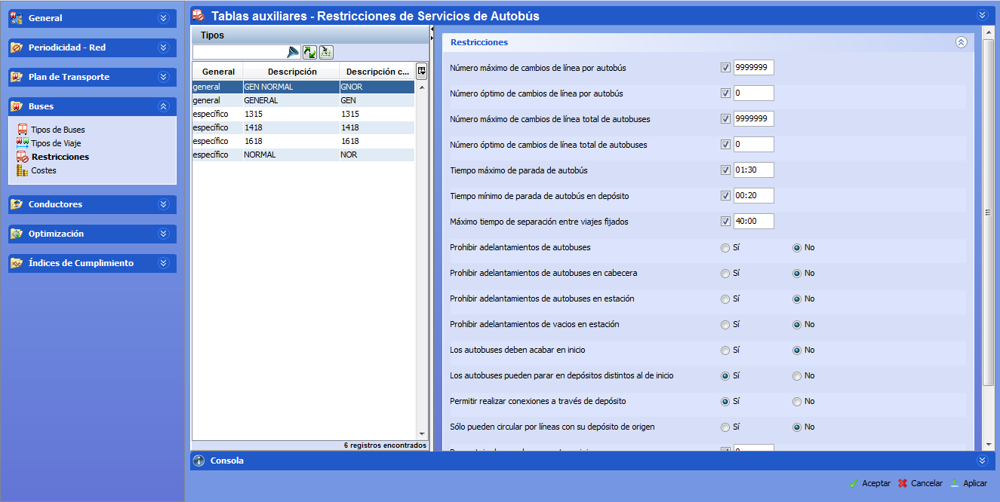

::: {#restricciones-de-autobús .section .level3}
### Restricciones de autobús

La ventana Restricciones permite establecer el valor de los parámetros
que controlan los tipos de autobús definidos en el panel de Tipos de
Buses.

[]{#_Toc465674516 .anchor}89 Restricciones de Tipos de autobús

La pestaña Restricciones es igual en tablas auxiliares y en cuadros, y
contiene estos paneles:

-   Tipos: lista de tipos de autobuses disponibles. En tablas auxiliares
    > corresponde a todos los tipos de autobús definidos, y en cuadros
    > contiene la lista de tipos de autobús que están activados en el
    > cuadro.

-   Parámetros: en el panel de la derecha aparecen una serie de
    > desplegables que contienen los parámetros. Las restricciones
    > disponibles varían dependiendo de si los turnos seleccionados son
    > de tipo general o específico.

El panel de parámetros contiene los valores de cada restricción que
definen el tipo de autobús seleccionado en el panel Tipos. Los tipos de
restricciones mostrados son diferentes según el tipo de autobús sea
general o específico.

Los valores de parámetros de las restricciones corresponden a la
definición del tipo de autobús seleccionado. Es posible seleccionar
varios tipos de autobús para realizar una edición múltiple de los
parámetros comunes a todos los tipos seleccionados, como se describe en
el apartado 3.8.1.5 Edición múltiple de parámetros.

**Nota.** Los parámetros disponibles en las restricciones y costes de
los tipos de autobús están descritos en detalle en el documento Manual
de Reglas.
:::
