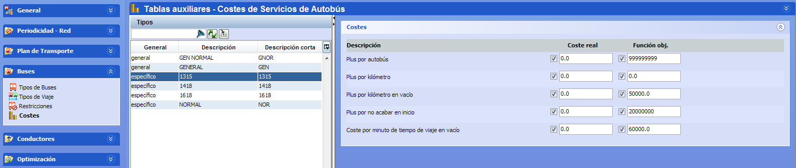

::: {#costes-por-tipos-específicos-de-autobús .section .level4}
#### Costes por tipos específicos de autobús

Cada tipo de autobús tiene asociadas reglas de costes para guiar la
optimización de todos los aspectos que definen el coste de operación del
vehículo. Los costes permiten establecer qué criterios de optimización
son más importantes, y priorizar la optimización de los costes
principales antes que los secundarios.

[]{#_Toc465674518 .anchor}91 Costes de Tipos específicos de autobús
:::
