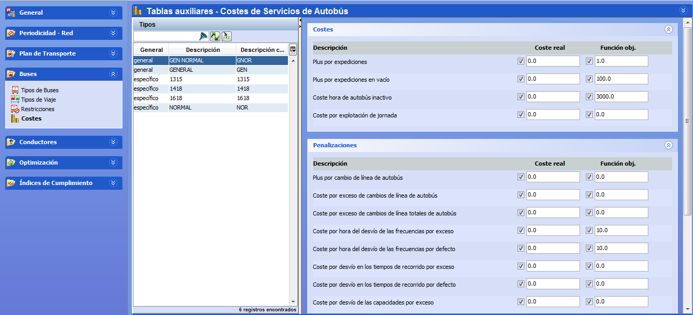

::: {#costes-de-autobús .section .level3}
### Costes de autobús

La ventana Costes permite establecer el peso de los costes asociados a
los tipos de autobús definidos en el panel de Tipos de Buses.

Los costes asociados al servicio de autobús incluido en un escenario se
completan en esta ventana, seleccionando dicho servicio de autobús y
dando valores a los costes asociados.

[]{#_Toc465674517 .anchor}90 Costes de Tipos de autobús
:::
