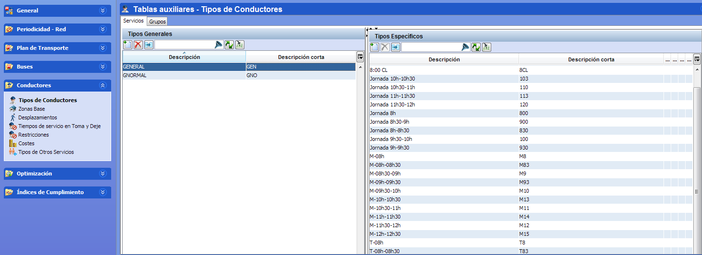
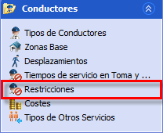
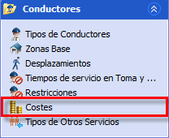

::: {#tipos-de-turno-generales .section .level4}
#### Tipos de turno generales

Las restricciones generales de conductores definen la normativa que
deben cumplir los servicios de conducción, relacionada principalmente
con condiciones legales, reglas de convenio, y reglas comunes de
planificación de los servicios. Por tanto, la plantilla de reglas
generales establece las condiciones de operación propias de los
conductores de la compañía de transporte.

[]{#_Toc465674520 .anchor}93 Tipos de turnos generales

Las reglas establecen condiciones generales sobre tiempos de seguridad
para la presencia en relevos, que sirven como colchón para poder cumplir
la planificación en caso de producirse retrasos moderados.

Los tiempos establecidos de actividad e inactividad, junto con las
duraciones de toma y deje de servicio, permiten incluir dentro de la
planificación los minutos que el conductor no está realizando trabajo
productivo de conducción pero sí se contabilizan dentro de su jornada.
Esto permite al algoritmo incorporar en el cálculo la jornada real de
trabajo, optimizando en función de la presencia real de los
trabajadores.

Por último, se ofrecen reglas para controlar la complejidad de la
operación, como limitar el número de cambios de bus y línea o las zonas
de inicio y fin de los trabajadores.

::: {#crear-un-tipo-de-turno-general .section .level5}
##### Crear un tipo de turno general

El panel Tipos generales situado a la izquierda de la ventana permite
crear nuevos tipos de turno general. Los parámetros que definen los
tipos de turno generales se especifican en la ventana Restricciones de
las reglas de conductor.

Los pasos para definir un nuevo tipo de turno general son:

1.  Pulsar el botón Crear un nuevo registro en el panel Tipos generales.

    1.  También es posible crear un nuevo tipo de turno general con los
        > mismos parámetros de un turno general ya existente,
        > seleccionando el tipo de turno que se quiere copiar y pulsando
        > el botón Opciones → Copiar en la barra de botones del panel
        > Tipos generales.

<!-- -->

1.  Hacer doble clic sobre la descripción y descripción corta de la
    nueva fila para modificar los valores creados por defecto.

2.  En la barra de navegación, en la sección Conductores seleccionar la
    ventana Restricciones.

[]{#_Toc465674521 .anchor}94 Restricciones Conductor

1.  En el panel Tipos, seleccionar la fila que corresponde al tipo
    general creado. En el panel de la derecha, seleccionar y editar los
    valores de los parámetros asociados a este tipo de turno.

2.  A continuación, en la barra de navegación seleccionar la ventana
    Costes.

[]{#_Toc465674522 .anchor}95 Coste Conductor

1.  Seleccionar la fila que corresponde al tipo general creado. En el
    panel de la derecha, seleccionar y editar los valores de los costes
    reales y objetivos asociados a este tipo de turno.

Es posible eliminar un tipo de turno general, seleccionándolo en el
panel Tipos generales y pulsando el botón Suprimir el registro. El tipo
de turno no se puede borrar si se está utilizado en algún cuadro.
:::
:::
