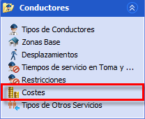

::: {#tipos-de-turno-específicos .section .level4}
#### Tipos de turno específicos

Las reglas de tipos de turnos de conductor específicos permiten
establecer las condiciones de trabajo de distintos conjuntos de
trabajadores dentro de la planificación. Habitualmente se utiliza para
definir el horario de los turnos de trabajo durante la jornada. Por
ejemplo, se pueden definir horarios de mañana, tarde y nocturnos o se
puede establecer una distinción entre jornada continua, partida y a
tiempo parcial. Cada tipo de turno establece las reglas de trabajo que
debe cumplir individualmente cada uno de los conductores de ese tipo.

[]{#_Toc465674523 .anchor}96 Tipos de turnos específicos

::: {#crear-un-tipo-de-turno-específico .section .level5}
##### Crear un tipo de turno específico

Los tipos de turno específicos se clasifican dentro de un conjunto de
categorías, indicadas en los paneles de la parte superior derecha. La
categorización de los tipos de turnos se hace en la creación de los
mismos y puede ser modificada posteriormente. Para crear un turno
específico:

1.  En el panel Tipos específicos pulsar el botón Crear un nuevo
    registro. Se crea una nueva fila con el tipo de turno clasificado
    con los valores de categorías seleccionados.

    1.  Es posible hacer una selección múltiple en una o en varias
        > categorías. En este caso, se crearán tantos turnos como
        > posibles combinaciones de los valores de las categorías
        > seleccionadas.

    2.  Si en alguna categoría no se selecciona ningún valor, esta
        > categoría no tendrá valor para los turnos creados.

    3.  También es posible crear un nuevo tipo de turno específico con
        > los mismos parámetros y categorías de un turno específico ya
        > existente, seleccionando el tipo de turno que se quiere copiar
        > y pulsando el botón Opciones → Copiar en la barra de botones
        > del panel Tipos específicos.

<!-- -->

1.  En la tabla de tipos específicos, hacer doble clic sobre la
    descripción y los valores de categorías de un tipo de turno para
    cambiar ese valor.

2.  En la barra de navegación, en la sección Reglas de conductor
    seleccionar la ventana Restricciones.

[]{#_Toc465674524 .anchor}97 Restricciones Conductor

1.  En el panel Tipos, seleccionar la fila que corresponde al tipo
    específico creado. En el panel de la derecha, seleccionar y editar
    los valores de los parámetros asociados a este tipo de turno.

2.  A continuación, en la barra de navegación seleccionar la ventana
    Costes.

[]{#_Toc465674525 .anchor}98 Coste Conductor

1.  Seleccionar la fila que corresponde al tipo específico creado. En el
    panel de la derecha, seleccionar y editar los valores de los costes
    reales y objetivos asociados a este tipo de turno.
:::
:::
