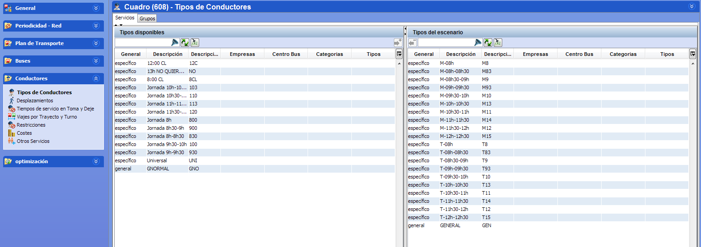

::: {#activar-tipos-de-turnos-en-el-escenario .section .level4}
#### Activar tipos de turnos en el escenario

En un escenario, la ventana Tipos de conductores permite activar los
tipos de turno que se permite utilizar en el cálculo de entre los
existentes definidos en tablas auxiliares.

La ventana contiene los siguientes paneles:

-   Filtros disponibles: categorías que permiten filtrar los tipos de
    > turno específicos.

-   Tipos disponibles: muestra los tipos de turno definidos en tablas
    > auxiliares. Se muestran los turnos generales y los específicos en
    > la misma tabla.

-   Tipos del escenario: muestra los tipos de turno activados para
    > utilizar en el cuadro.

[]{#_Toc465674526 .anchor}99 Tipos de turno activos en un cuadro

Los pasos para activar los servicios que se desean utilizar en el
cálculo son los siguientes:

1.  Opcionalmente, utilizar las categorías para filtrar un conjunto de
    tipos de turno específicos visibles en la lista de tipos de turnos
    disponibles y del escenario.

2.  En el panel Tipos disponibles, seleccionar los tipos de turno que se
    quieren utilizar en el cálculo. En esta ventana es posible
    seleccionar a la vez tipos de turno generales y específicos.

<!-- -->

1.  Pulsar el botón Aceptar para incluir en el cuadro una copia de los
    tipos de turno seleccionados.

**Nota.** En un escenario solo se puede usar un tipo de turno general,
ya que sus reglas se aplican a todos los conductores del escenario, pero
en tablas auxiliares puede haber varios tipos de turno generales para
usarlos en escenarios alternativos.

Sí se pueden incluir varios tipos de turno específicos en un mismo
escenario, para indicar los diferentes turnos de los conductores en la
jornada.

Los tipos añadidos al cuadro inicialmente utilizan los parámetros que
tienen definidos en tablas auxiliares. Es posible modificar los
parámetros que se utilizarán en el cálculo cambiándolos en las ventanas
Restricciones y Costes de conductor en el cuadro, sin que se modifique
la definición guardada en tablas auxiliares.

Para desactivar la utilización de un tipo de turno en el escenario,
seleccionarlo en el panel Tipos del escenario y pulsar el botón
Suprimir.
:::
