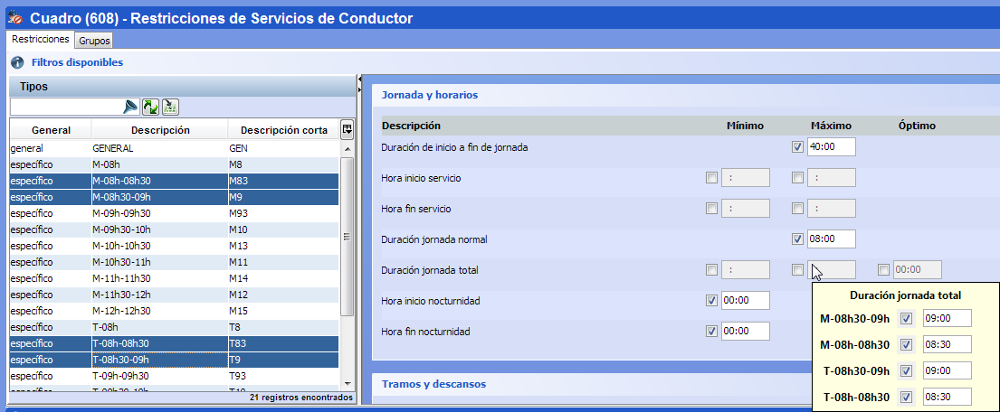

::: {#edición-múltiple-de-parámetros .section .level4}
#### Edición múltiple de parámetros

Las ventanas de restricciones y costes permiten asignar simultáneamente
el mismo valor en un parámetro para un conjunto de turnos. Para ello, se
realiza una selección múltiple de los turnos que se quiere modificar
simultáneamente. La selección se puede realizar manualmente o mediante
los filtros de categorías, como se describe en el apartado Selección
múltiple.

Los tipos de turno seleccionados deben ser todos generales o todos
específicos; si la selección incluye turnos generales y específicos, el
panel de parámetros se desactiva de manera que no permite realizar
modificaciones.

Una vez hecha la multiselección de los tipos de turnos, los parámetros o
costes aparecerán del siguiente modo:

-   En aquellos parámetros o costes cuyo valor y estado de activación es
    > el mismo para todos los turnos seleccionados, aparecerán con el
    > valor común a todos ellos.

[]{#_Toc465674527 .anchor}100 Caja de parámetros

-   En aquellos parámetros o costes cuyo valor o estado de activación no
    > coinciden para todos los turnos seleccionados, el parámetro
    > aparece sin valor definido, con la caja de texto vacía y marcada
    > con fondo gris. Esto representa que el parámetro contiene valores
    > diferentes en los tipos de turno seleccionados.

[]{#_Toc465674528 .anchor}101 Caja de parámetros con múltiples valores
en los turnos seleccionados

Tanto si el valor del parámetro o coste está vacío como si tiene valor,
es posible introducir un valor nuevo en el parámetro. Al introducir un
nuevo valor o cambiar el estado de asignación, este cambio se asigna
como el valor del parámetro para todos los tipos de turno seleccionados.
Es decir, en todos los turnos se sustituirá el valor que tuvieran en el
parámetro o coste en cuestión por el nuevo valor introducido.

[]{#_Toc465674529 .anchor}102 Ventana de edición múltiple

Al pasar el puntero del ratón sobre un parámetro, se muestra una ventana
emergente (tooltip). En caso de realizar una selección múltiple de
varios tipos de turno, en el tooltip se muestran los distintos valores
que toma ese mismo parámetro en los tipos de turno seleccionados.

[]{#_Toc465674530 .anchor}103 Valores de un mismo parámetro en varios
tipos de turno seleccionados
:::
