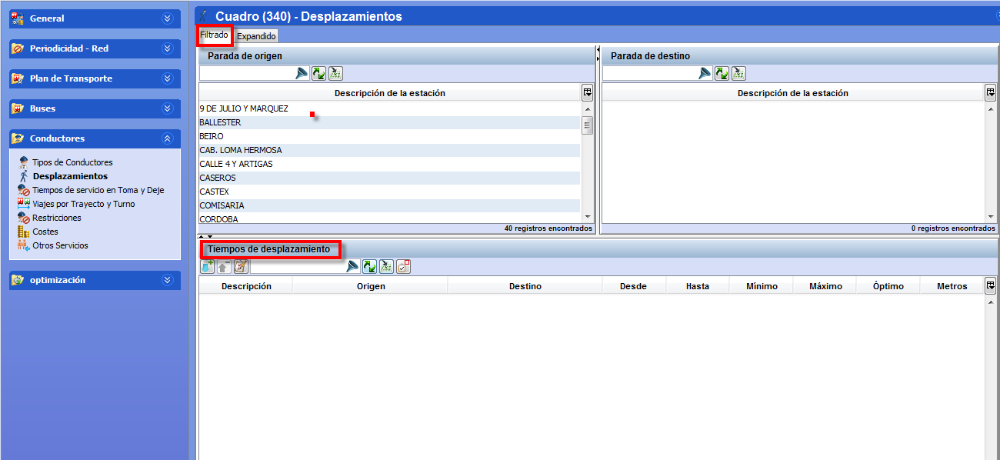

::: {#desplazamientos .section .level3}
### Desplazamientos

Esta ventana contiene los tiempos que necesita un servicio de conductor
para realizar un desplazamiento sin autobús. Un desplazamiento siempre
tiene dos paradas asociadas, la parada origen y la parada destino. Ambas
paradas deben tener capacidad de relevo de servicios de conductor para
que entre ellas sea posible un desplazamiento.

Al igual que para los tiempos de recorrido, los tiempos de
desplazamiento pueden definirse por franjas horarias.

[]{#_Toc465674531 .anchor}104 Ventana Desplazamientos
:::
