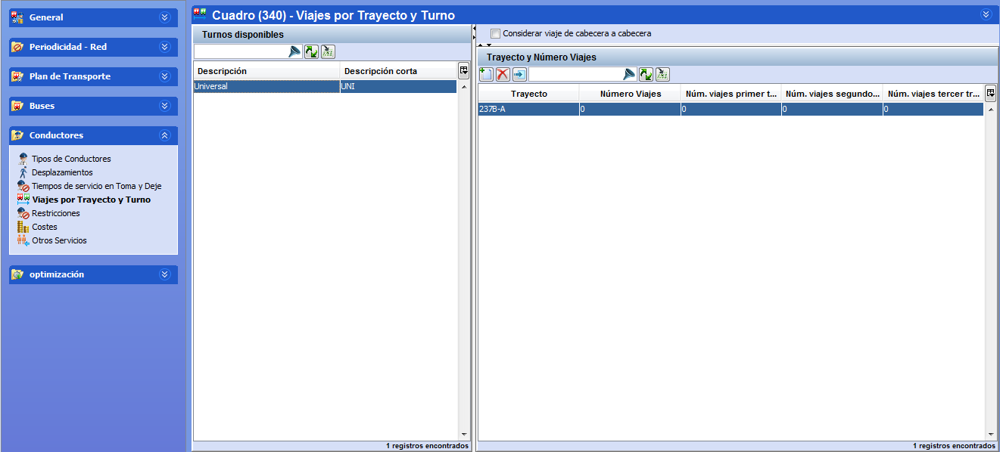

::: {#viajes-por-trayecto-y-turno .section .level3}
### Viajes por trayecto y turno

Esta restricción permite la posibilidad de imponer a cada tipo de turno
un número máximo de viajes por trayecto o grupo de trayectos, en cada
uno de sus tramos de conducción o en el total de la jornada.

Sirve para controlar que algunos tipos de turno no tengan permiso para
realizar trayectos para los que no están capacitados, poniendo a 0 el
máximo para cada trayecto prohibido. También se puede limitar la
cantidad de veces que un mismo conductor realiza trayectos difíciles o
poco deseables el mismo día, o durante una parte de su jornada.

[]{#_Toc465674532 .anchor}105 Ventana Viajes por Trayecto y Turno de
Servicio de Conductor

Por cada tipo de turno se tiene la posibilidad de introducir tantas
limitaciones como se desee para cualquier combinación de trayectos o
grupos de trayectos. De este modo, se flexibiliza la herramienta en
cuanto a la posibilidad de determinar exactamente qué trayectos queremos
permitir o no dentro de un mismo turno.

**Nota.** El máximo número de trayectos es una restricción relajada.
Esto quiere decir que al inicio del cálculo pueden aparecer turnos
inválidos que superan este máximo.

La ventana Viajes por trayecto y turno está situada dentro de
Conductores.

-   Turnos disponibles: Muestra los tipos de turno definidos. Al
    > seleccionar un tipo de turno se actualizan los paneles Trayecto y
    > Número Viajes y Trayecto y Número Viajes por Grupo para mostrar
    > los valores del turno seleccionado.

-   Trayecto y Número Viajes: Muestra los trayectos en los que el tipo
    > de turno seleccionado tiene restringido el máximo número de viajes
    > que puede realizar.

-   Trayecto y Número Viajes por Grupo: Muestra el máximo número de
    > viajes que puede realizar el tipo de turno seleccionado en cada
    > grupo de trayectos en los que está restringido.

En el ejemplo siguiente, el tipo de turno definido sólo podría hacer 4
viajes del trayecto 237B-A antes del primer descanso (primer tramo) y un
único viaje del trayecto 237B-A después del primer descanso (segundo
tramo).

[]{#_Toc465674533 .anchor}106 Número de viajes por trayecto
:::
