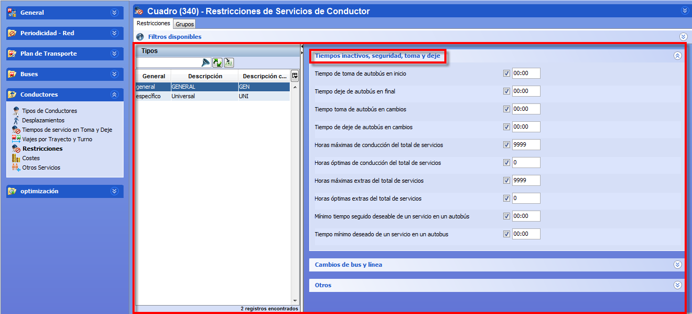

::: {#restricciones-de-conductor .section .level3}
### Restricciones de conductor

La ventana Restricciones permite establecer el valor de los parámetros
que controlan los tipos de turno definidos en el panel de Tipos de
Conductores.

[]{#_Toc465674534 .anchor}107 Restricciones de Tipos de turno

**Nota.** La ventana de restricciones contiene dos pestañas:
Restricciones, donde se definen los parámetros de los tipos de turno
individuales, y Grupos, donde se establecen restricciones sobre el
tamaño de uno o varios grupos de trabajadores del mismo tipo. Las reglas
sobre grupos de conductores se describen en la sección Grupos de
conductores.

La pestaña Restricciones es igual en tablas auxiliares y en cuadros, y
contiene estos paneles:

-   Filtros disponibles: Permite filtrar los tipos de turno en función
    > de los filtros definidos por el usuario. Se accede pulsando el
    > botón Filtros disponibles.

-   Tipos: lista de tipos de turno disponibles. En tablas auxiliares
    > corresponde a todos los tipos de turno definidos, y en cuadros
    > contiene la lista de tipos de turno que están activados en el
    > cuadro.

-   Parámetros: en el panel de la derecha aparecen una serie de
    > desplegables que contienen los parámetros. Las restricciones
    > disponibles varían dependiendo de si los turnos seleccionados son
    > de tipo general o específico.

El panel de parámetros contiene los valores de cada restricción que
definen el tipo de turno seleccionado en el panel Tipos. Los tipos de
restricciones mostrados son diferentes según el tipo de turno sea
general o específico.

Los valores de parámetros de las restricciones corresponden a la
definición del tipo de turno seleccionado. Es posible seleccionar varios
tipos de turno para realizar una edición múltiple de los parámetros
comunes a todos los tipos seleccionados, como se describe en el apartado
3.8.1.5 Edición múltiple de parámetros.

**Nota.** Los parámetros disponibles en las restricciones y costes de
los tipos de turno están descritos en detalle en el documento Manual de
Reglas.
:::
