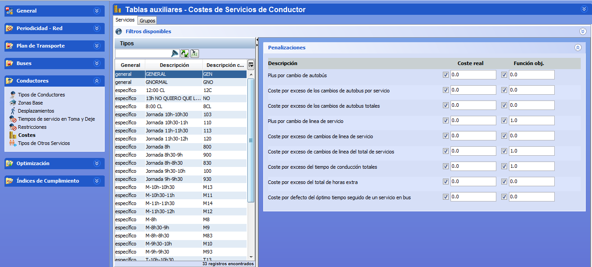

::: {#costes-generales-de-conductor .section .level4}
#### Costes generales de conductor

Los costes generales permiten establecer la importancia relativa que
dará el algoritmo de cálculo de soluciones a la optimización de los
criterios definidos en los valores óptimos de la ventana Restricciones
generales.

La ventana de costes generales de conductor se encuentra en la carpeta
Costes dentro de Generales, junto con las restricciones generales de
conductor. Los costes asociados al servicio de conductor general
incluido en un escenario se completan en esta ventana, seleccionando
dicho servicio de conductor y dando valores a los costes asociados.

[]{#_Toc465674536 .anchor}109 Costes generales de conductor

Existen los siguientes tipos de costes generales de conductor:

-   []{#_Toc462045635 .anchor}Penalizaciones por cambios de autobús

-   []{#_Toc462045636 .anchor}Cambios de línea

-   []{#_Toc462045637 .anchor}Exceso de horas

-   Otros costes generales
:::
