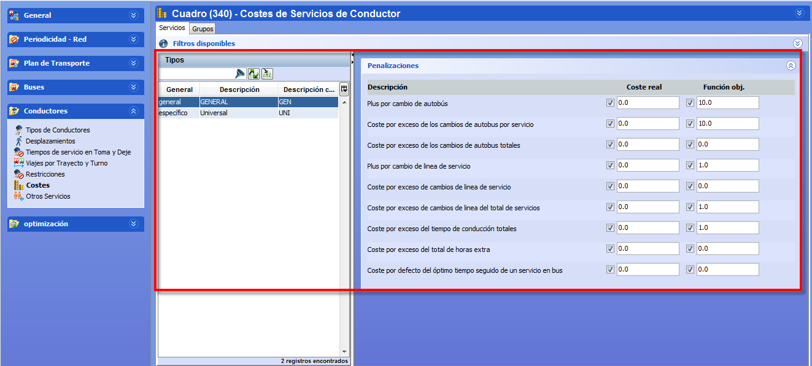

::: {#costes-de-conductor .section .level3}
### Costes de conductor

La ventana Costes permite establecer el peso de los costes asociados a
los tipos de turno definidos en el panel de Tipos de Conductores.

[]{#_Toc465674535 .anchor}108 Costes de Tipos de turno

La ventana es igual en tablas auxiliares y en cuadros, y contiene estos
paneles:

-   Filtros disponibles: Permite filtrar los tipos de turno en función
    > de los filtros definidos por el usuario. Se accede pulsando el
    > botón Filtros disponibles.

-   Tipos: lista de tipos de turno disponibles. En tablas auxiliares
    > corresponde a todos los tipos de turno definidos, y en cuadros
    > contiene la lista de tipos de turno que están activados en el
    > cuadro.

-   Parámetros: en el panel de la derecha aparecen una serie de
    > desplegables que contienen los parámetros. Los costes disponibles
    > varían dependiendo de si los turnos seleccionados son de tipo
    > general o específico.

Es posible seleccionar varios tipos de turno para realizar una edición
múltiple de los parámetros comunes a todos los tipos seleccionados, como
se describe en la sección Edición múltiple de parámetros.

El panel de parámetros contiene los valores de cada coste que definen el
tipo de turno seleccionado en el panel Tipos. Por cada tipo de coste es
posible especificar dos valores:

-   Coste real: el coste real representa el valor monetario asociado a
    > incumplir la penalización de la regla de coste. Se utiliza como
    > valoración puramente económica de las soluciones y no tiene efecto
    > en el cálculo de optimización.

-   Coste objetivo: el coste objetivo es el peso matemático asociado a
    > cada penalización. Puede ser proporcional a un coste económico
    > real, o representar un criterio de calidad intangible sin impacto
    > económico directo.

**Nota.** Las reglas de coste con valor de coste objetivo más alto son
las que tienen prioridad al intentar optimizar la solución durante el
cálculo.
:::
