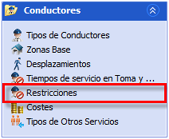

::: {#crear-nuevos-grupos .section .level4}
#### Crear nuevos grupos

La regla de grupos de conductores permite crear tantos grupos distintos
como se necesiten. La creación de los grupos se hace siempre en tablas
auxiliares. Los grupos creados en tablas auxiliares podrán ser
utilizados posteriormente en los cuadros. El cuadro será posible
modificar los turnos que pertenecen a los grupos y las restricciones que
se aplican sobre el tamaño del grupo.

Los pasos para definir un nuevo grupo son:

1.  En tablas auxiliares, pulsar en el botón Crear un nuevo registro del
    panel Grupos.

<!-- -->

1.  Hacer doble clic sobre la descripción y descripción corta del nuevo
    grupo para modificar los valores creados por defecto.

2.  Añadir los tipos de turno que pertenecen al grupo, como se indica en
    el apartado siguiente: Incluir tipos de turno en el grupo.

3.  En la barra de navegación, en la sección Reglas de conductor
    seleccionar la ventana Restricciones.

[]{#_Toc465674538 .anchor}111 Restricciones de Conductor

1.  En el panel Grupos, seleccionar la fila que corresponde al grupo
    creado. En el panel de la derecha, seleccionar y editar los valores
    de los parámetros que definen el tamaño de este grupo.

Para quitar un tipo de turno de un grupo en el que está incluido, se
debe seleccionar en el panel Tipos de grupo y pulsar el botón Suprimir.

Un mismo tipo de turno específico puede estar añadido en varios grupos.
Los conductores de este tipo de turno se cuentan para el tamaño de todos
los grupos en los que el tipo está incluido.
:::
