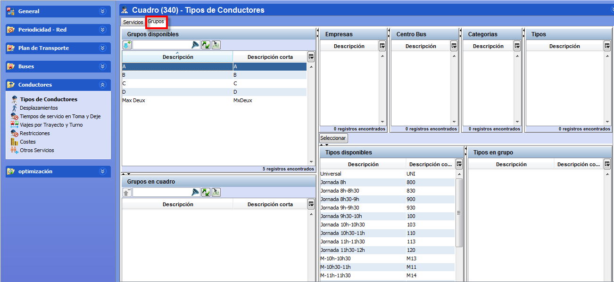

::: {#activar-grupos-en-el-cálculo .section .level4}
#### Activar grupos en el cálculo

Al abrir la ventana Tipos en un cuadro, la pestaña Grupos permite
activar los grupos que se permite utilizar en el cálculo de entre los
existentes definidos en tablas auxiliares.

[]{#_Toc465674539 .anchor}112 Grupos de conductores en escenarios

Los paneles que permiten activar grupos para el cálculo son:

-   Grupos disponibles: lista de grupos definidos en tablas auxiliares
    > disponibles para ser utilizados.

-   Grupos en cuadro: grupos que se han activado para el cálculo en el
    > cuadro.

Para añadir un grupo y activarlo para el cálculo, seleccionar el grupo
en el panel Grupos disponibles y pulsar el botón Aceptar. Esto crea en
el cuadro una copia de los parámetros del grupo tal como está definido
en tablas auxiliares.

En el cuadro no es posible crear nuevos grupos, pero sí es posible
cambiar su definición, alterando la lista de tipos de turno que
pertenecen al grupo. Los cambios realizados en el cuadro no afectan a la
definición original del grupo en tablas auxiliares.

**Nota.** Si la definición del grupo en tablas auxiliares contiene tipos
de turno que no están activos en el escenario, al activar ese grupo se
puede escoger entre activar estos tipos de turno automáticamente, o bien
eliminarlos de la definición del grupo incluida en el cuadro.

Se puede eliminar del cálculo un grupo activado, seleccionándolo en el
panel Grupos en cuadro y pulsando el botón
Suprimir.[[[[[[[[[[[[[[[[[[[[[[[[[[[[[[[[[[[[[[[[[[[[[[[[[[[[[[[[[[[[[[[[[[[[[[[[[[[[[[[[[[[[[[[[[[[[[[[[[[[[[[[[[[[[[[[[[[[[[[[[[[[[[[[[[[[[[[[[[[[[[[[[[[[[[[[[[[[[[[[[[[[[[[[[[[[[[[[[[[[[[[[[[[[[[[[[[[[[[[[[[[[[[[[[[[[[[[[[[[[[[[[[[[[[[[[[[[[[[[[[[[[[[[[[[[[[[[[[[[[[[[[[[[[[[[[[[[[[[[[[[[[[[[[[[[[[[[[[[[[[[]{#_Toc405283289
.anchor}]{#_Toc451359077 .anchor}]{#_Toc451358750
.anchor}]{#_Toc462076642 .anchor}]{#_Toc462070539
.anchor}]{#_Toc462076641 .anchor}]{#_Toc462070538
.anchor}]{#_Toc462076640 .anchor}]{#_Toc462070537
.anchor}]{#_Toc462076639 .anchor}]{#_Toc462070536
.anchor}]{#_Toc462076638 .anchor}]{#_Toc462070535
.anchor}]{#_Toc462076637 .anchor}]{#_Toc462070534
.anchor}]{#_Toc462076636 .anchor}]{#_Toc462070533
.anchor}]{#_Toc462076635 .anchor}]{#_Toc462070532
.anchor}]{#_Toc462076634 .anchor}]{#_Toc462070531
.anchor}]{#_Toc462076633 .anchor}]{#_Toc462070530
.anchor}]{#_Toc462076632 .anchor}]{#_Toc462070529
.anchor}]{#_Toc462076631 .anchor}]{#_Toc462070528
.anchor}]{#_Toc462076630 .anchor}]{#_Toc462070527
.anchor}]{#_Toc462076629 .anchor}]{#_Toc462070526
.anchor}]{#_Toc462076628 .anchor}]{#_Toc462070525
.anchor}]{#_Toc462076627 .anchor}]{#_Toc462070524
.anchor}]{#_Toc462076626 .anchor}]{#_Toc462070523
.anchor}]{#_Toc462076625 .anchor}]{#_Toc462070522
.anchor}]{#_Toc462076624 .anchor}]{#_Toc462070521
.anchor}]{#_Toc462076623 .anchor}]{#_Toc462070520
.anchor}]{#_Toc462076622 .anchor}]{#_Toc462070519
.anchor}]{#_Toc462076621 .anchor}]{#_Toc462070518
.anchor}]{#_Toc462076620 .anchor}]{#_Toc462070517
.anchor}]{#_Toc462076619 .anchor}]{#_Toc462070516
.anchor}]{#_Toc462076618 .anchor}]{#_Toc462070515
.anchor}]{#_Toc462076617 .anchor}]{#_Toc462070514
.anchor}]{#_Toc462076616 .anchor}]{#_Toc462070513
.anchor}]{#_Toc462076615 .anchor}]{#_Toc462070512
.anchor}]{#_Toc462076614 .anchor}]{#_Toc462070511
.anchor}]{#_Toc462076613 .anchor}]{#_Toc462070510
.anchor}]{#_Toc462076612 .anchor}]{#_Toc462070509
.anchor}]{#_Toc462076611 .anchor}]{#_Toc462070508
.anchor}]{#_Toc462076610 .anchor}]{#_Toc462070507
.anchor}]{#_Toc462076609 .anchor}]{#_Toc462070506
.anchor}]{#_Toc462076608 .anchor}]{#_Toc462070505
.anchor}]{#_Toc462076607 .anchor}]{#_Toc462070504
.anchor}]{#_Toc462076606 .anchor}]{#_Toc462070503
.anchor}]{#_Toc462076605 .anchor}]{#_Toc462070502
.anchor}]{#_Toc462076604 .anchor}]{#_Toc462070501
.anchor}]{#_Toc462076603 .anchor}]{#_Toc462070500
.anchor}]{#_Toc462076602 .anchor}]{#_Toc462070499
.anchor}]{#_Toc462076601 .anchor}]{#_Toc462070498
.anchor}]{#_Toc462076600 .anchor}]{#_Toc462070497
.anchor}]{#_Toc462076599 .anchor}]{#_Toc462070496
.anchor}]{#_Toc462076598 .anchor}]{#_Toc462070495
.anchor}]{#_Toc453777303 .anchor}]{#_Toc451421227
.anchor}]{#_Toc451359337 .anchor}]{#_Toc451359060
.anchor}]{#_Toc451358733 .anchor}]{#_Toc447540930
.anchor}]{#_Toc453777302 .anchor}]{#_Toc451421226
.anchor}]{#_Toc451359336 .anchor}]{#_Toc451359059
.anchor}]{#_Toc451358732 .anchor}]{#_Toc447540929
.anchor}]{#_Toc453777301 .anchor}]{#_Toc451421225
.anchor}]{#_Toc451359335 .anchor}]{#_Toc451359058
.anchor}]{#_Toc451358731 .anchor}]{#_Toc447540928
.anchor}]{#_Toc453777300 .anchor}]{#_Toc451421224
.anchor}]{#_Toc451359334 .anchor}]{#_Toc451359057
.anchor}]{#_Toc451358730 .anchor}]{#_Toc447540927
.anchor}]{#_Toc453777299 .anchor}]{#_Toc451421223
.anchor}]{#_Toc451359333 .anchor}]{#_Toc451359056
.anchor}]{#_Toc451358729 .anchor}]{#_Toc447540926
.anchor}]{#_Toc453777298 .anchor}]{#_Toc451421222
.anchor}]{#_Toc451359332 .anchor}]{#_Toc451359055
.anchor}]{#_Toc451358728 .anchor}]{#_Toc447540925
.anchor}]{#_Toc453777297 .anchor}]{#_Toc451421221
.anchor}]{#_Toc451359331 .anchor}]{#_Toc451359054
.anchor}]{#_Toc451358727 .anchor}]{#_Toc447540924
.anchor}]{#_Toc453777296 .anchor}]{#_Toc451421220
.anchor}]{#_Toc451359330 .anchor}]{#_Toc451359053
.anchor}]{#_Toc451358726 .anchor}]{#_Toc447540923
.anchor}]{#_Toc453777295 .anchor}]{#_Toc451421219
.anchor}]{#_Toc451359329 .anchor}]{#_Toc451359052
.anchor}]{#_Toc451358725 .anchor}]{#_Toc447540922
.anchor}]{#_Toc453777294 .anchor}]{#_Toc451421218
.anchor}]{#_Toc451359328 .anchor}]{#_Toc451359051
.anchor}]{#_Toc451358724 .anchor}]{#_Toc447540921
.anchor}]{#_Toc453777293 .anchor}]{#_Toc451421217
.anchor}]{#_Toc451359327 .anchor}]{#_Toc451359050
.anchor}]{#_Toc451358723 .anchor}]{#_Toc447540920
.anchor}]{#_Toc453777292 .anchor}]{#_Toc451421216
.anchor}]{#_Toc451359326 .anchor}]{#_Toc451359049
.anchor}]{#_Toc451358722 .anchor}]{#_Toc447540919
.anchor}]{#_Toc453777291 .anchor}]{#_Toc451421215
.anchor}]{#_Toc451359325 .anchor}]{#_Toc451359048
.anchor}]{#_Toc451358721 .anchor}]{#_Toc447540918
.anchor}]{#_Toc453777290 .anchor}]{#_Toc451421214
.anchor}]{#_Toc451359324 .anchor}]{#_Toc451359047
.anchor}]{#_Toc451358720 .anchor}]{#_Toc447540917
.anchor}]{#_Toc453777289 .anchor}]{#_Toc451421213
.anchor}]{#_Toc451359323 .anchor}]{#_Toc451359046
.anchor}]{#_Toc451358719 .anchor}]{#_Toc447540916
.anchor}]{#_Toc453777288 .anchor}]{#_Toc451421212
.anchor}]{#_Toc451359322 .anchor}]{#_Toc451359045
.anchor}]{#_Toc451358718 .anchor}]{#_Toc447540915
.anchor}]{#_Toc462076597 .anchor}]{#_Toc462070494
.anchor}]{#_Toc462076596 .anchor}]{#_Toc462070493
.anchor}]{#_Toc462076595 .anchor}]{#_Toc462070492
.anchor}]{#_Toc462076594 .anchor}]{#_Toc462070491
.anchor}]{#_Toc462076593 .anchor}]{#_Toc462070490
.anchor}]{#_Toc462076592 .anchor}]{#_Toc462070489
.anchor}]{#_Toc462076591 .anchor}]{#_Toc462070488
.anchor}]{#_Toc462076590 .anchor}]{#_Toc462070487
.anchor}]{#_Toc462076589 .anchor}]{#_Toc462070486
.anchor}]{#_Toc462076588 .anchor}]{#_Toc462070485
.anchor}]{#_Toc462076587 .anchor}]{#_Toc462070484
.anchor}]{#_Toc462076586 .anchor}]{#_Toc462070483
.anchor}]{#_Toc462076585 .anchor}]{#_Toc462070482
.anchor}]{#_Toc451359042 .anchor}]{#_Toc451358715
.anchor}]{#_Toc462076584 .anchor}]{#_Toc462070481
.anchor}]{#_Toc462076583 .anchor}]{#_Toc462070480
.anchor}]{#_Toc462076582 .anchor}]{#_Toc462070479
.anchor}]{#_Toc462076581 .anchor}]{#_Toc462070478
.anchor}]{#_Toc462076580 .anchor}]{#_Toc462070477
.anchor}]{#_Toc462076579 .anchor}]{#_Toc462070476
.anchor}]{#_Toc462076578 .anchor}]{#_Toc462070475
.anchor}]{#_Toc462076577 .anchor}]{#_Toc462070474
.anchor}]{#_Toc462076576 .anchor}]{#_Toc462070473
.anchor}]{#_Toc462076575 .anchor}]{#_Toc462070472
.anchor}]{#_Toc462076574 .anchor}]{#_Toc462070471
.anchor}]{#_Toc462076573 .anchor}]{#_Toc462070470
.anchor}]{#_Toc462076572 .anchor}]{#_Toc462070469
.anchor}]{#_Toc462076571 .anchor}]{#_Toc462070468
.anchor}]{#_Toc462076570 .anchor}]{#_Toc462070467
.anchor}]{#_Toc462076569 .anchor}]{#_Toc462070466
.anchor}]{#_Toc462076568 .anchor}]{#_Toc462070465
.anchor}]{#_Toc462076567 .anchor}]{#_Toc462070464
.anchor}]{#_Toc462076566 .anchor}]{#_Toc462070463
.anchor}]{#_Toc462076565 .anchor}]{#_Toc462070462
.anchor}]{#_Toc462076564 .anchor}]{#_Toc462070461
.anchor}]{#_Toc462076563 .anchor}]{#_Toc462070460
.anchor}]{#_Toc462076562 .anchor}]{#_Toc462070459
.anchor}]{#_Toc462076561 .anchor}]{#_Toc462070458
.anchor}]{#_Toc462076560 .anchor}]{#_Toc462070457
.anchor}]{#_Toc462076559 .anchor}]{#_Toc462070456
.anchor}]{#_Toc462076558 .anchor}]{#_Toc462070455
.anchor}]{#_Toc462076557 .anchor}]{#_Toc462076556
.anchor}]{#_Toc462076555 .anchor}]{#_Toc462076554
.anchor}]{#_Toc462076553 .anchor}]{#_Toc462076552
.anchor}]{#_Toc462076551 .anchor}]{#_Toc462076550
.anchor}]{#_Toc462076549 .anchor}]{#_Toc462076548
.anchor}]{#_Toc462076547 .anchor}]{#_Toc462076546
.anchor}]{#_Toc462076545 .anchor}]{#_Toc462076544
.anchor}]{#_Toc462076543 .anchor}]{#_Toc462076542
.anchor}]{#_Toc462076541 .anchor}]{#_Toc462076540
.anchor}]{#_Toc462076539 .anchor}]{#_Toc462076538
.anchor}]{#_Toc462076537 .anchor}]{#_Toc462076536
.anchor}]{#_Toc462076535 .anchor}]{#_Toc462076534
.anchor}]{#_Toc462076533 .anchor}]{#_Toc462076532
.anchor}]{#_Toc462076531 .anchor}]{#_Toc462076530
.anchor}]{#_Toc462076529 .anchor}]{#_Toc462076528 .anchor}
:::
