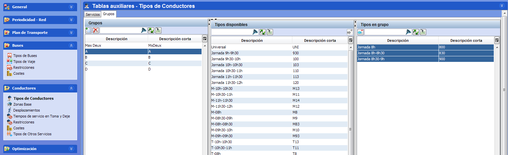

::: {#grupos-de-conductores .section .level3}
### Grupos de conductores

La regla de grupos permite establecer restricciones sobre el tamaño de
uno o varios grupos de trabajadores. Cada grupo se define como una
combinación de tipos de turnos de conductor. El tamaño del grupo se
calcula contando todos los conductores incluidos en la solución que
pertenecen a uno de los tipos de turno incluidos en el grupo.

[]{#_Toc465674537 .anchor}110 Grupos de conductores

Es posible indicar el número máximo y mínimo de conductores que deben
incluirse en cada grupo, o indicar el tamaño deseado del grupo como un
porcentaje sobre el total de conductores de la solución.

En Tablas auxiliares, la ventana Turnos contiene una pestaña llamada
Grupos que permite definir y gestionar los grupos de conductores
existentes en la base de datos. Cada grupo recibe una descripción larga
y un código corto.

La pestaña Grupos contiene los siguientes paneles:

-   Grupos: Lista de todos los grupos que se han definido en la base de
    > datos.

    -   Al abrir la ventana desde un cuadro, este panel se divide en dos
        > partes: Grupos disponibles y Grupos activos en el cuadro.

-   Categorías: permite filtrar y seleccionar los tipos de turno en
    > función de las categorías definidas en el panel Tipos de
    > Conductores.

-   Tipos disponibles: lista de los tipos de turno específicos que no
    > están incluidos en el grupo.

-   Tipos en grupo: lista de los tipos de turno específicos que están
    > incluidos en el grupo.
:::
