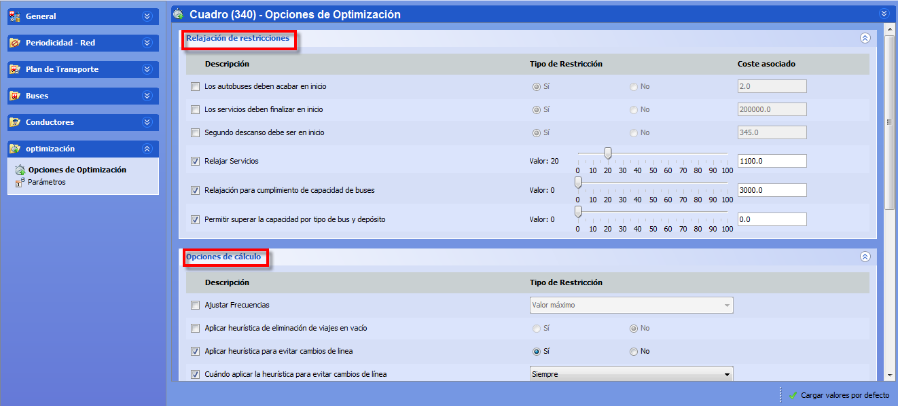

::: {#opciones-de-optimización .section .level3}
### Opciones de optimización

Como respuesta a nuestros usuarios avanzados, se ha creado unas
funcionalidades para poder configurar diferentes métodos de
optimización.

[]{#_Toc465674540 .anchor}113 Opciones de optimización

Si se encuentra activa esta funcionalidad, se permite activar o
desactivar opciones para dedicar tiempo de cálculo adicional a
reducciones de costes concretos, y relajar el cumplimiento de
restricciones permitiendo superar los límites de servicios en las
soluciones iniciales.

**Nota.** El uso de estas funcionalidades de optimización debe estar
supeditado al análisis detallado de los resultados de cálculo obtenidos.
Dicho análisis se debe realizar con el apoyo de los consultores de
optimización de GOAL SYSTEMS.

Los parámetros disponibles en las opciones de optimización están
descritos en detalle en el documento Manual de Reglas.
:::
