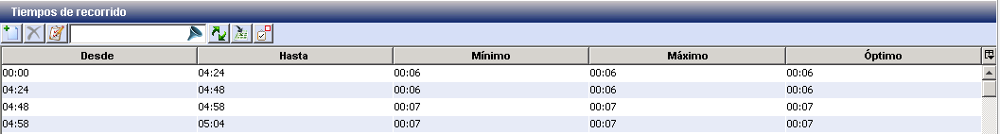
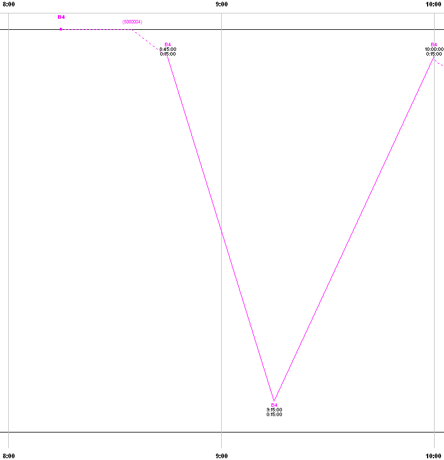
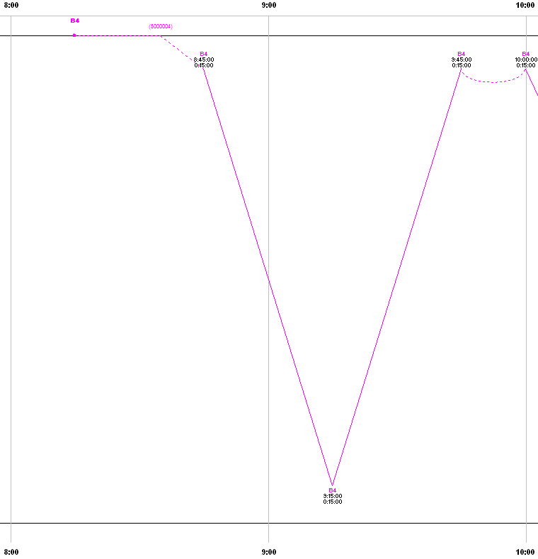

::: {#tiempos-de-recorrido-1 .section .level4}
#### Tiempos de recorrido

Este parámetro permite controlar la variación de tiempos de recorrido en
trayectos formados por varios arcos y paradas intermedias, de tal modo
que se pueda llegar a soluciones similares o mejores a las obtenidas
cuando trabajamos con un solo arco.

El parámetro determina la definición de la parada de origen respecto del
cual medir los Tiempos de recorrido. Los Tiempos de recorrido se
establecen para una franja horaria cualquiera y determinan para cada
línea y sentido el tiempo mínimo, máximo y óptimo que podrá durar la
expedición. El valor del parámetro permite afectar cómo se definen estos
tiempos de recorrido, eligiendo entre varias opciones.

::: {#por-arco .section .level5}
##### Por arco

Los tiempos definidos en la tabla Tiempos de recorrido indican el tiempo
que se tarda en recorrer cada arco correspondiente, desde el inicio al
fin del arco.

Las variaciones en los tiempos de recorrido respecto del tiempo óptimo
se asocian al último arco del trayecto.
:::

::: {#por-viaje .section .level5}
##### Por viaje

Los desvíos respecto del tiempo de recorrido óptimo se aplican
repartidos a lo largo del trayecto entero, en lugar de aplicarlos sólo
al último arco.
:::

::: {#salida-en-cabecera .section .level5}
##### Salida en cabecera

El tiempo de recorrido se define para todo el viaje el tiempo de paso
por la parada final del arco desde el origen del trayecto, no el tiempo
de arco. Es decir, al seleccionar este parámetro, todos los valores de
la tabla Tiempos de recorrido se miden relativos al punto de inicio del
trayecto, no al punto intermedio anterior dentro del trayecto.
:::

::: {#salida-de-terminal-que-regula .section .level5}
##### Salida de terminal que regula

Esta función hace que el tiempo de recorrido se cuente desde su salida
en el terminal establecido en la línea como punto de regulación hasta su
vuelta al mismo, sin permitir modificaciones en puntos intermedios del
trayecto. Si durante el recorrido hay un cambio de franja horaria, esto
no afecta a la expedición de vuelta, que toma como tiempo de recorrido
el que se define en la terminal de salida.

Es decir, las expediciones de ida y vuelta de un mismo trayecto
mantienen el mismo Tiempo de recorrido hasta su vuelta al punto de
origen marcado como parada de regulación. El Tiempo de recorrido que se
utiliza es aquel que está vigente en la franja horaria en la que
comienza la primera expedición en la terminal de salida, incluso si la
franja horaria cambia durante las expediciones.

Este parámetro es útil en líneas circulares, o en líneas con varios
trayectos en los que cada trayecto tiene un único sentido de modo que el
sentido de ida está en un trayecto distinto que el sentido de vuelta.
:::

::: {#ejemplo .section .level5}
##### Ejemplo

Veamos un ejemplo de tiempos de recorrido definidos en una línea con dos
sentidos. Los tiempos son iguales en ambos sentidos, y varían por franja
horaria:

[]{#_Toc465674541 .anchor}114 Tiempos de recorrido en sentido 1 y 2

Dado que el comienzo del trayecto se establece en las cabeceras, el
primero de los trayectos del ejemplo tendrá una duración de 30 minutos
por tener lugar su comienzo a las 8:45 (entre las 00:00 y las 09:00).
Sin embargo, el segundo de los trayectos tiene origen a las 09:15 y como
ya nos encontraríamos en la segunda franja horaria la cual tiene un
tiempo de recorrido establecido de 45 minutos, esta será la duración de
dicho trayecto.

-   Salida en cabecera

En este ejemplo, al configurar los tiempos de recorrido con Salida en
cabecera, cada viaje individual toma el tiempo de recorrido definido en
el horario en que comienza el viaje en la cabecera.

[]{#_Toc465674542 .anchor}115 Solución para Salida en cabecera: 30
minutos ida, 45 minutos vuelta

En el viaje mostrado, la ida toma el tiempo de la franja horaria
definida a las 8:45, y el regreso toma el tiempo definido a las 9:15.

-   Salida de terminal que regula

En la siguiente imagen se muestra el mismo escenario configurando con el
valor Salida de terminal que regula. Se establece como parada de
regulación únicamente la cabecera inicial en el sentido de ida, y no la
de la vuelta.

Este parámetro garantiza que, hasta volver a la terminal que regula, los
trayectos de ida y vuelta tendrán unos tiempos de recorrido cuyo valor
será el establecido a la hora de salida desde la cabecera que regula.

Por ello, y como se observa en la imagen siguiente, la ida toma el
tiempo de la franja horaria definida a las 8:45, pero el regreso no toma
el tiempo definido a las 9:15, sino el definido en la última parada de
regulación visitada a las 8:45.

Así, pese a que el comienzo del segundo de los trayectos tiene lugar
durante la segunda franja horaria, el Tiempo de recorrido seguirá siendo
de 30 minutos pues es el establecido en el momento de su salida desde la
cabecera que regula.

[]{#_Toc465674543 .anchor}116 Solución para Salida de terminal que
regula: 30 minutos ida, 30 minutos vuelta
:::
:::
