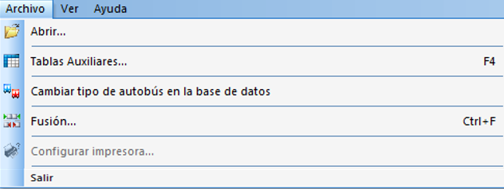

::: {#menú-archivo .section .level4}
#### Menú Archivo

El menú Archivo contiene las siguientes opciones:

-   Nuevo: Crea un nuevo escenario GoalBus®.

-   Abrir: Abre un escenario previamente guardado.

-   Tablas Auxiliares: Accede a la ventana de Tablas auxiliares.

-   Configurar Impresora: Abre la ventana de configuración de impresión
    > estándar de Windows.

-   Archivo reciente: Abrir escenarios ya existentes Se accede de forma
    > automática a los escenarios existentes en la base de datos.

-   Salir: Sale de la aplicación.

[]{#_Toc465674544 .anchor}117 Menú Archivo[[[[[]{#_Toc289165929
.anchor}]{#_Toc250448384 .anchor}]{#_Toc222135855
.anchor}]{#_Toc221622760 .anchor}]{#_Toc128972510 .anchor}
:::
