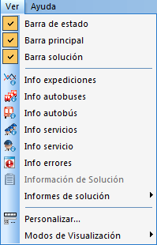
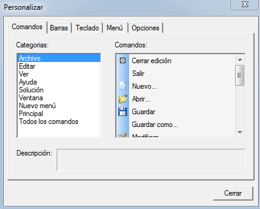

::: {#menú-ver .section .level4}
#### Menú Ver

En este menú, las opciones Barra de estado, Barra principal, Barra
solución, Barra informes, Info expediciones, Info autobuses e Info
servicios pueden estar activadas o no, de forma que el usuario tiene la
posibilidad de ocultar o mostrar cada una de ellas.

[]{#_Toc465674545 .anchor}118 Menú Ver

La opción Personalizar abre una ventana que permite determinar los
botones que deben aparecer en cada menú, barra de herramientas, ... Esta
ventana funciona como en cualquier otra herramienta Windows, y no se
darán, por lo tanto, más detalles sobre ella.

[[[[]{#_Toc250448385 .anchor}]{#_Toc222135856 .anchor}]{#_Toc221622761
.anchor}]{#_Toc128972511 .anchor} 

[]{#_Toc465674546 .anchor}119 Personalizar[]{#_Toc289165930 .anchor}
:::
