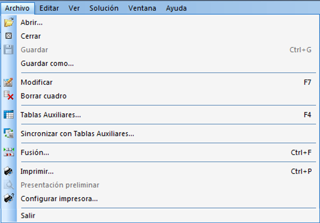
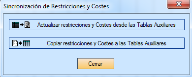

::: {#menú-archivo-1 .section .level4}
#### Menú Archivo

[]{#_Toc465674548 .anchor}121 Menú Archivo

Las nuevas opciones que aparecen en este menú con un escenario abierto
son las siguientes:

-   Cerrar: Al hacer clic sobre esta herramienta el usuario cerrará el
    > escenario abierto.

-   Guardar: Esta herramienta permite al usuario almacenar un escenario
    > junto con las soluciones encontradas.

-   Guardar como... Esta herramienta permite teniendo abierto el
    > escenario de trabajo hacer una copia de ese e introducir el nombre
    > que se desee al nuevo escenario.

-   Modificar: Con esta herramienta, el usuario puede una vez abierto un
    > escenario modificar todos los datos relativos al escenario.

-   Borrar: Escenario Elimina el escenario de forma permanente.

-   Sincronizar Tablas Auxiliares: Haciendo clic sobre esta herramienta
    > aparece la ventana de la ilustración siguiente. Esta ventana
    > permite copiar los datos de restricciones y costes de un escenario
    > en las tablas auxiliares, o viceversa.

[]{#_Toc465674549 .anchor}122 Sincronización con las Tablas auxiliares

-   Imprimir: Haciendo clic sobre esta opción se imprime directamente la
    > solución que estemos viendo con unas características por defecto.

-   Presentación preliminar: El usuario puede ver con anterioridad la
    > forma en la que imprime la solución.
:::
