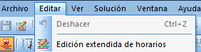

::: {#menú-editar .section .level4}
#### Menú Editar

Desde la opción del menú Editar es posible acceder al módulo Editor
manual de solución, usando la opción Edición extendida de horarios.
Dicho módulo es explicado en detalle en el Manual del Editor,
especificando todas las funcionalidades y el modo de uso de las mismas.

[]{#_Toc465674550 .anchor}123 Editor de solución
:::
