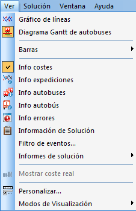
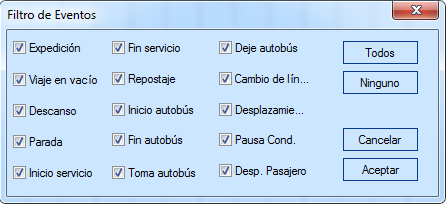

::: {#menú-ver-1 .section .level4}
#### Menú Ver

Con este menú el usuario puede escoger los elementos que desea
visualizar en la pantalla.

[]{#_Toc465674551 .anchor}124 Menú Ver

Las opciones de este menú son las siguientes:

-   Gráfico de líneas: Permite visualizar la evolución temporal de la
    > solución por líneas.

-   Diagrama de Gantt de autobuses: Permite visualizar la evolución
    > temporal de la solución por autobuses.

-   Diagrama de Gantt de servicios: Permite visualizar la evolución
    > temporal de la solución por servicios de conductor.

-   Filtro de eventos: Abre una ventana en la que el usuario puede
    > escoger de entre todos los eventos GoalBus® los que desea que se
    > muestren en la visualización de la solución.

[]{#_Toc465674552 .anchor}125 Filtro Eventos

-   Muestra coste real: Permite elegir entre los dos tipos de costes, es
    > decir, costes reales o costes objetivo.
:::
