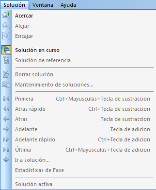
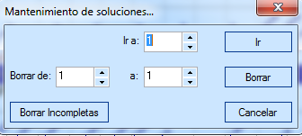
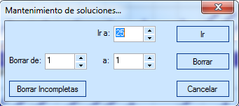

::: {#menú-solución .section .level4}
#### Menú Solución

En un escenario con soluciones calculadas, este menú permite al usuario
desplazarse entre las soluciones disponibles y mantenerlas.

[]{#_Toc465674553 .anchor}126 Menú Solución

-   Acercar: Agranda el aspecto del diagrama mostrado en la ventana de
    > diagramación de soluciones.

-   Alejar: Encoge el aspecto del diagrama mostrado en la ventana de
    > diagramación de soluciones.

-   Encajar: Acopla todo el diagrama de soluciones en la ventana.

-   Solución en curso: Si se activa permite ver en la ventana principal
    > de diagramación de soluciones la evolución de la solución en
    > curso.

-   Borrar solución: Borra la solución seleccionada en ese momento.

-   Mantenimiento de soluciones... Si se hace clic aparece la siguiente
    > ventana:

[]{#_Toc465674554 .anchor}127 Mantenimiento Soluciones

Esta ventana permite al usuario situarse en una solución determinada
inmediatamente. Además, le permite borrar soluciones: de una en una,
como en el caso que se representa en la imagen, o en forma de bloque,
como por ejemplo borrar desde la solución 3 hasta la 15.

-   Primera: Permite ir a la primera de las soluciones encontradas por
    > GoalBus®.

-   Atrás rápido: Permite retroceder en las soluciones de forma rápida.

-   Atrás: Posibilita retroceder una a una entre todas las soluciones de
    > un escenario o problema.

-   Adelante: Permite avanzar entre las soluciones.

-   Adelante rápido: Permite el avance entre las soluciones de un
    > escenario o problema de forma rápida.

-   Última: Permite el acceso a la última de las soluciones encontradas
    > por GoalBus®.

-   Ir a solución... Si se hace clic sobre esta herramienta aparece la
    > ventana de la siguiente ilustración que permite ir directamente al
    > número de solución deseada.

[]{#_Toc465674555 .anchor}128 Ventana Ir a solución nº
:::
