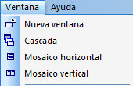

::: {#menú-ventana .section .level4}
#### Menú Ventana

Este menú permite ordenar las distintas ventanas abiertas y desplazarse
de una a otra. Funciona como un menú Ventana estándar de Windows, por lo
tanto, no se darán más explicaciones en este apartado.

[]{#_Toc465674556 .anchor}129 Menú Ventana
:::
