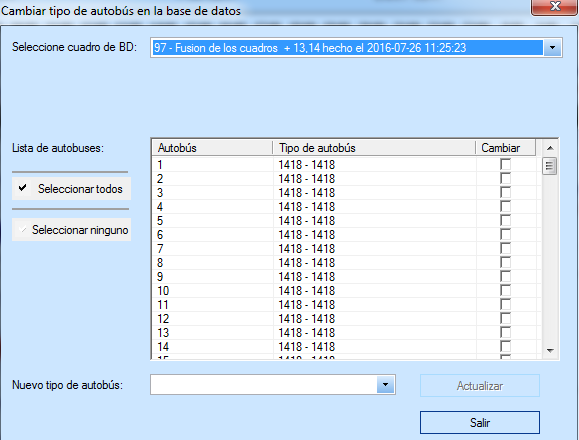
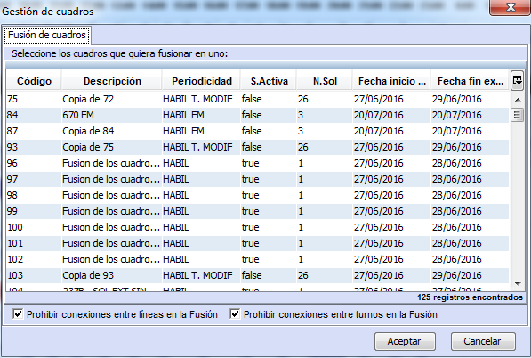
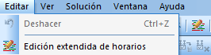
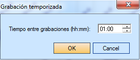
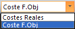

::: {#barra-principal .section .level4}
#### Barra Principal

La barra principal contiene varios botones que realizan las mismas
operaciones que los menús detallados en el apartado anterior. Para estos
botones, no se dará ninguna explicación, tan sólo se indicará el menú
equivalente.

[]{#_Toc465674558 .anchor}131 Barra principal

 Abrir: (Equivalente a Archivo Abrir...)

 Guardar: (Equivalente a Archivo Guardar)

 Modificar: (Equivalente a Archivo Modificar)

 Borrar: (Equivalente a Archivo Borrar cuadro)

 Abrir soluciones de Base de Datos

 Cargar solución de fichero

 Salvar la solución visualizada a fichero

 Tablas auxiliares: Equivalente a (Archivo
Tablas Auxiliares...)

 Sincronizar con tablas auxiliares: Equivalente
a (Archivo Sincronizar con Tablas Auxiliares)

 Cambiar tipo de autobús en base de datos

GoalBus® dispone de un editor para cambiar de forma masiva el tipo de
autobús asignado a una selección de autobuses.[]{#_Toc222131159 .anchor}

[]{#_Toc465674559 .anchor}132 Cambiar tipo de autobús en BD

Al actualizar el cuadro de base de datos, se cambia la solución grabada
para cambiar el tipo de los autobuses seleccionados al nuevo tipo
seleccionado.

 o  Fusionar cuadros:
Equivalente a (Archivo Fusión...)

La opción Fusionar cuadros permite juntar líneas de diferentes cuadros
calculados en uno solo, para después lanzar un nuevo cálculo que
contenga todos esos datos. Siguiendo esta metodología se pueden ahorrar
autobuses y servicios, ya que se pueden combinar entre las distintas
líneas. Hay que tener en cuenta que los cuadros a fusionar no deben
compartir líneas, ya que de ser así no sería posible saber de qué cuadro
debería tomar la solución para dichas líneas. El procedimiento de
fusionado avisa con un mensaje en caso de no respetar esta regla.

Para poder utilizar esta funcionalidad se puede pulsar el icono Fusión
que se encuentra en el Gestor de Cuadros o pulsar el icono fusión que se
encuentra en la barra de herramientas de la solución del cuadro. A
continuación se muestra dónde se pueden encontrar ambos iconos:

[]{#_Toc465674560 .anchor}133 Fusionar cuadros en el gestor de
escenarios

[]{#_Toc465674561 .anchor}134 Fusionar cuadros en la barra principal

Al seleccionar esta opción, aparecerá una ventana emergente con todos
los cuadros y una vez allí se seleccionarán aquellos de estos sobre los
que se quiera realizar la fusión:

[]{#_Toc465674562 .anchor}135 Ventana gestión de cuadros

Posteriormente únicamente pulsando el botón "aceptar" GoalBus®.
Comenzará la fusión.

En esta ventana aparece la opción "Prohibir conexiones entre líneas en
la Fusión", que permite elegir si se quieren prohibir las conexiones
entre líneas al realizar la fusión. De tal forma que si es activada no
se mezclarán líneas dentro del cuadro fusionado.

[]{#_Toc465674563 .anchor}136 Icono edición desde la barra de
herramienta

 Editor manual de soluciones: Equivalente a
(Editar Editar solución)

A través de los iconos anteriores o del menú Editar se puede acceder al
editor de soluciones de GoalBus®

[]{#_Toc465674564 .anchor}137 Menú Editar

**Nota.** Existe un manual propio del editor de soluciones de GoalBus®.
Para más información póngase en contacto con GOAL SYSTEMS.

 Opciones de
búsqueda

De izquierda a derecha permiten, respectivamente, detener, lanzar y
pausar la búsqueda de soluciones y lanzar la búsqueda de soluciones paso
a paso.

 Grabación temporizada

Al activar esta herramienta, la aplicación graba de forma automática las
soluciones que va encontrando GoalBus® cada unidad de tiempo que el
usuario elija. El usuario escoge dicha unidad de tiempo gracias a la
ventana de la ilustración a continuación:

[]{#_Toc465674565 .anchor}138 Grabación temporizada

El proceso de grabación temporizada consiste en guardar la primera y la
última de las soluciones encontradas, pudiendo además grabar soluciones
cada cierto intervalo de tiempo, definido en el campo Tiempo entre
grabaciones (hh:mm).

Así, cuando se para el proceso de búsqueda de soluciones el usuario
cuenta con la primera solución encontrada y la última solución
encontrada en el último intervalo de tiempo. Esto permitirá tener
soluciones guardadas en cálculos que se demoren en el tiempo, ante
cualquier imprevisto que pueda acaecer.

 Información expediciones: Equivalente a (Ver
Info expediciones)

Ver explicaciones detalladas en el apartado 4.4.4.

 Información autobuses: Equivalente a (Ver Info
autobuses)

Ver explicaciones detalladas en el apartado 4.4.2.

 Información autobús: Equivalente a (Ver Info
autobús)

Ver explicaciones detalladas en el apartado 4.4.2.

 Información servicios: Equivalente a (Ver Info
Servicios)

Ver explicaciones detalladas en el apartado 4.4.3.

 Información servicio: Equivalente a (Ver Info
Servicio)

Ver explicaciones detalladas en el apartado 4.4.3.

 Muestra un resumen de la solución

Ver explicaciones detalladas en el apartado 4.4.6.

 Exportar capacidades de depósitos

 Evolución de los costes

Ver explicaciones detalladas en el apartado 4.5.1.

 Evolución de los eventos

Ver explicaciones detalladas en el apartado 4.5.2.

 Evolución de los recursos

Ver explicaciones detalladas en el apartado 4.5.3.

 Ver informe: Equivalente a (Ver Informes de
solución Ver informe)

 Mostrar información de errores: Equivalente a
(Ver Info errores)

Ver explicaciones detalladas en el apartado 4.4.5.

 Filtro: Equivalente a (Ver Filtro de
eventos...)

Ver explicaciones detalladas en el apartado 4.6.

 **Preferencias de cálculo**

 Costes: Equivalente a (Ver Mostrar coste real)

Este despegable permite escoger entre visualizar los costes reales o los
costes objetivo de la solución.

 Impresión: Equivalente a (Archivo Imprimir,
Configurar impresión y Presentación Preliminar)

 Acerca de GoalBus®... Equivalente a (Ayuda
Acerca de GoalBus®)
:::
