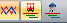
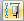
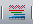
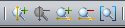

::: {#barra-solución .section .level4}
#### Barra Solución

En la barra de soluciones tenemos cada una de las opciones que nos
permiten personalizar el aspecto de las soluciones de []{#_Toc222131161
.anchor}GoalBus® y gestionarlas.

 Visualización de soluciones: Equivalente a
(Ver Gráfico de líneas, Diagrama de Gantt de autobuses, Diagrama de
Gantt de servicios)

 Subdivisiones expediciones

Activa los puntos intermedios dentro de una línea -- trayecto.

 Opciones visualización: Equivalente a (Ver
Barras Opciones de visualización)

 Zoom: Equivalente a (Ver Acercar, Alejar,
Encajar)

 Lupa: Permite una visualización detallada de
los eventos, aumentando la visualización de los diagramas, tanto en
horizontal como en vertical.

 Solución en curso: Equivalente a (Ver Solución
en curso)

 Borrar: Equivalente a (Ver Borrar,
Mantenimiento de soluciones)

 Escoger Solución

Este grupo de botones permite, por este orden: Visualizar la primera
solución, retroceder de cinco en cinco soluciones (retroceso rápido),
retroceder una solución, indica la solución que se está visualizando (2
de 3), avanzar una solución, avanzar cinco soluciones (avance rápido) y
visualizar la última solución. Por último, también es posible introducir
con el teclado en el escenario de edición central la solución que se
desea visualizar.[[[[[]{#_Toc289165940 .anchor}]{#_Toc250448395
.anchor}]{#_Toc222135866 .anchor}]{#_Toc221622771
.anchor}]{#_Toc128972523 .anchor}
:::
