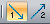
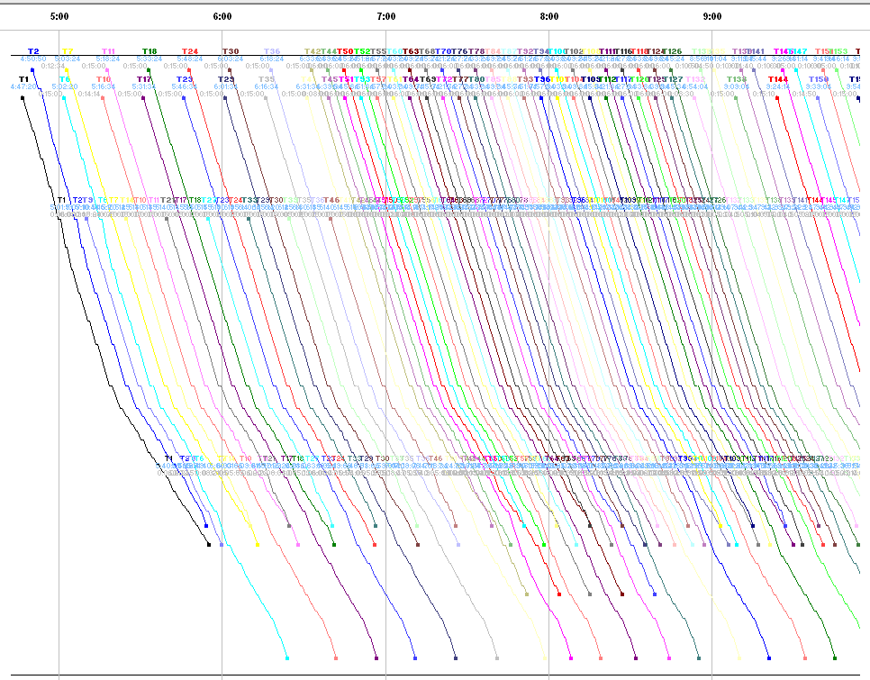
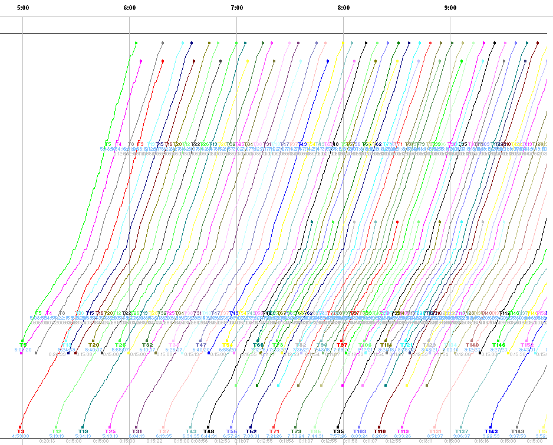
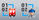

::: {#barra-opciones-gráfico-de-líneas .section .level4}
#### Barra Opciones Gráfico de Líneas

Una vez activado el botón Opciones de visualización aparece la barra de
la ilustración:

[]{#_Toc465674566 .anchor}139 Barra Opciones Gráfico de Líneas

Gracias a ella, se puede personalizar la visualización de la solución en
la ventana principal de un gráfico de líneas.

De izquierda a derecha, permiten mostrar u ocultar los autobuses, los
servicios de conductor, las expediciones, los viajes en vacío, los
cambios de línea, las paradas en cabecera, visualizar los bloques de
vehículos, de conductor y el botón de visualización de líneas
separándolas o no en sus trayectos.

Los tipos de visualización por bloques de vehículos y por bloques de
servicios de conductor, permiten enumerar los vehículos y los servicios
de conductor de una forma distinta. Activando estas opciones se obtendrá
un tipo de visualización que depende del orden que siguen los vehículos
y los servicios de conductor en la secuencia de salidas por frecuencia.
Estos cambios podrán apreciarse:

-   en la ventana principal de diagramación de soluciones,

-   en la ventana de información de servicios de conductor,

-   en la ventana de información de vehículos.

Esto es muy habitual en líneas urbanas que funcionan por frecuencia. En
empresas que funcionan por horarios bastará con no activar estas
opciones para obtener el tipo de visualización habitual que depende
únicamente del orden en el que los vehículos y los servicios de
conductor entran en servicio.

-    Filtros por sentido. Permiten mostrar solo
    > los viajes en sentido de ida o de vuelta, ocultando el sentido
    > contrario.

Al marcar solamente el icono de sentido 1, se visualizarán únicamente
las expediciones de ida en el trayecto:

De igual modo, si activamos únicamente el icono de sentido 2, se
visualizarán las expediciones de regreso:

-    Numeración de servicios de autobús y
    > conductor por línea o trayecto.

Los botones de bloques cambian la numeración de los autobuses y
conductores en cuadros con varios trayectos, para darles un nombre en
función de su trayecto principal. Por defecto, con el botón desactivado,
los buses y conductores se numeran en función de la hora de inicio (B1,
B2, B3...) con una sola secuencia numérica para todos. Con el botón
activo, se crea una numeración para cada trayecto. Por ejemplo si hay
líneas L1 y L2, se crea una secuencia (L1-1, L1-2, L1-3...) para los
autobuses o conductores asignados principalmente a la línea L1, y otra
secuencia aparte que también comienza en 1 (L2-1, L2-2, L2-3...) para
los autobuses o conductores asignados principalmente a la línea L2.

El último botón de esta ventana permite la visualización del gráfico de
líneas de tres formas distintas:

-    Al activar esta forma de visualización,
    > los trayectos se representan el gráfico por separado.

En un gráfico con tres líneas y dos trayectos en cada línea, se
observarán seis grupos independientes.

-   Al activar esta forma de visualización,
    > todos los trayectos de una línea se visualizan juntos y las líneas
    > se visualizan por separado.

En un gráfico con tres líneas y dos trayectos en cada línea, se verán
tres grupos compuesto cada uno de dos trayectos agrupados por línea.

-    Al activar esta forma de visualización,
    > todos los trayectos y todas las líneas se visualizan juntos.

En un gráfico con tres líneas y dos trayectos en cada línea, se verá un
grupo compuesto de todos los trayectos de todas las
líneas.[[[[[]{#_Toc289165941 .anchor}]{#_Toc250448396
.anchor}]{#_Toc222135867 .anchor}]{#_Toc221622772
.anchor}]{#_Toc128972524 .anchor}
:::
