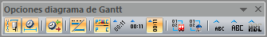

::: {#barra-opciones-diagramas-de-gantt .section .level4}
#### Barra Opciones Diagramas de Gantt

En caso de encontrarnos con una solución en la forma de un Diagrama de
Gantt de autobuses o de un Diagrama de Gantt de Servicios de conductor,
al hacer clic sobre el botón Opciones de Visualización aparece la barra
de herramientas de la ilustración:

[]{#_Toc333431464 .anchor}

[]{#_Toc465674567 .anchor}140 Barra Opciones Diagramas de Gantt

Mediante dicha ventana, el usuario puede visualizar la solución en la
forma que más le convenga en cada momento.

De izquierda a derecha los botones de esta barra permiten mostrar los
nombres de las paradas, la duración de cada evento, las horas de salida
y llegada de cada expedición, mostrar el trayecto dónde se produce el
evento, evitar la superposición de literales, poner los literales con
distintas inclinaciones, mostrar o no la numeración por trayectos tanto
de autobús como de conductor y, por último, elegir el tamaño de fuente
de los literales.
:::
