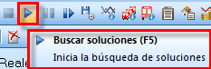

::: {#barras-de-herramientas .section .level3}
### Barras de herramientas

En este apartado vamos a describir cada una de las barras que aparecen
dentro de la aplicación GoalBus®.

Como nota adicional, interactuando con la interfaz es posible obtener
información explicativa sobre las funcionalidades mediante el uso de
ventanas emergentes (tooltips). Posicionando el cursor del ratón sobre
los botones de las diferentes barras de utilidades, aparecerán ventanas
emergentes con información aclaratoria del botón, y las teclas rápidas
asociadas:

[]{#_Toc465674557 .anchor}130 Ventana emergente (tooltip)
:::
