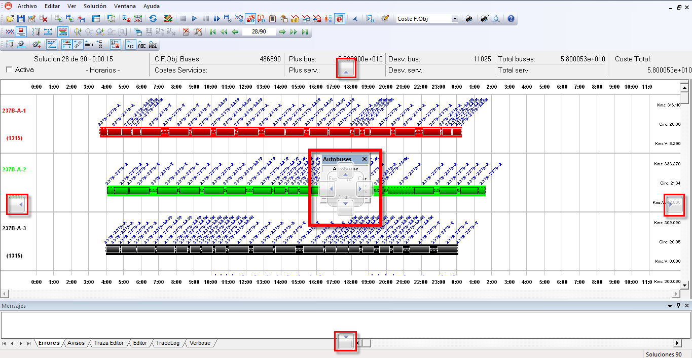
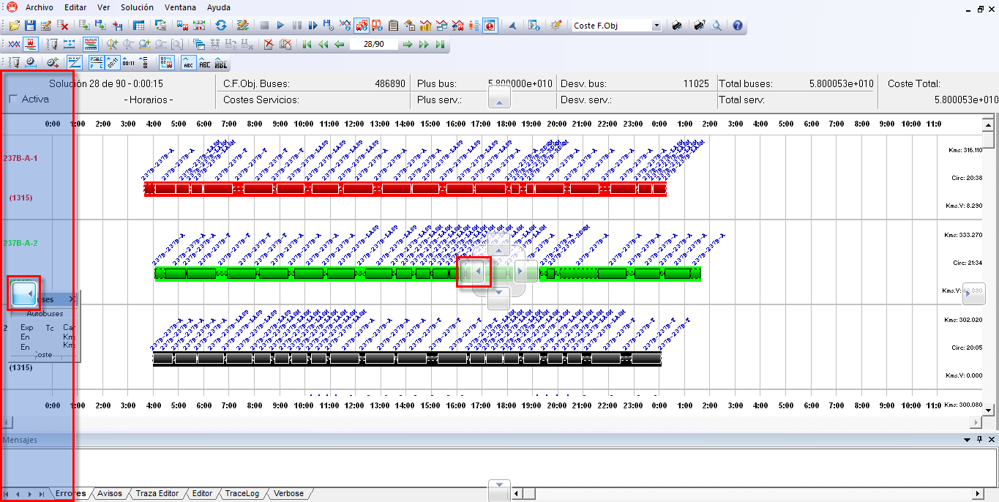

::: {#indicadores-de-margen .section .level4}
#### Indicadores de margen

Seleccionando y arrastrando el encabezado de la ventana aparece una
serie de indicadores que señalizan dónde se puede ubicar la ventana de
información seleccionada.

En la siguiente imagen se muestra una ventana de información arrastrada
con el ratón, y los indicadores que aparecen en la interfaz de GoalBus®:

[]{#_Toc465674569 .anchor}142 Indicadores de margen

Desplazando la ventana de información a cualquier indicador, aparecerá
sombreada de azul la zona en la que se ubicará dicha ventana.

En el caso siguiente se lleva la ventana de información de autobús al
margen izquierdo de la interfaz:

[]{#_Toc465674570 .anchor}143 Colocación de un panel en el margen
izquierdo de la ventana
:::
