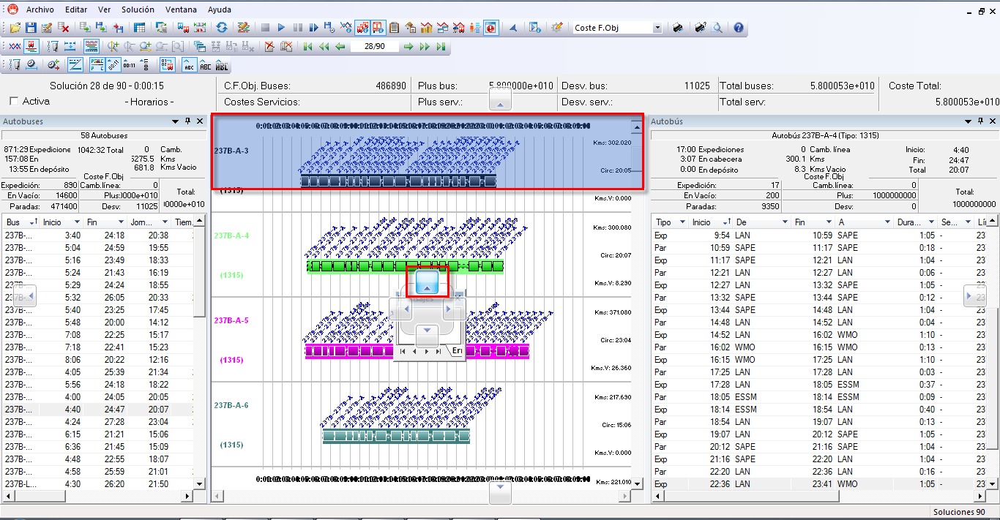
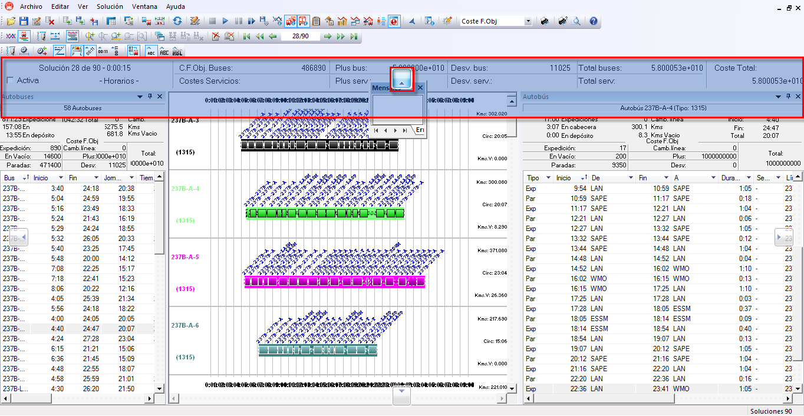
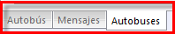
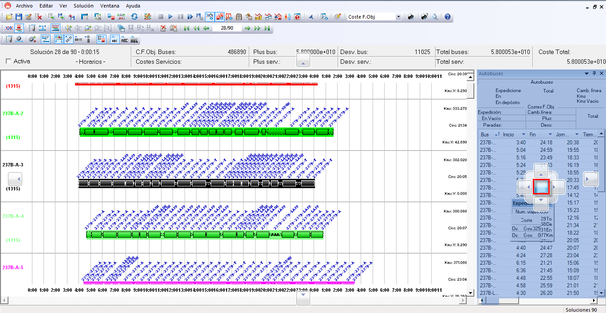
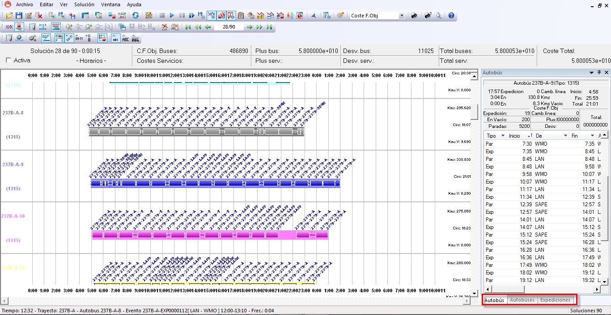
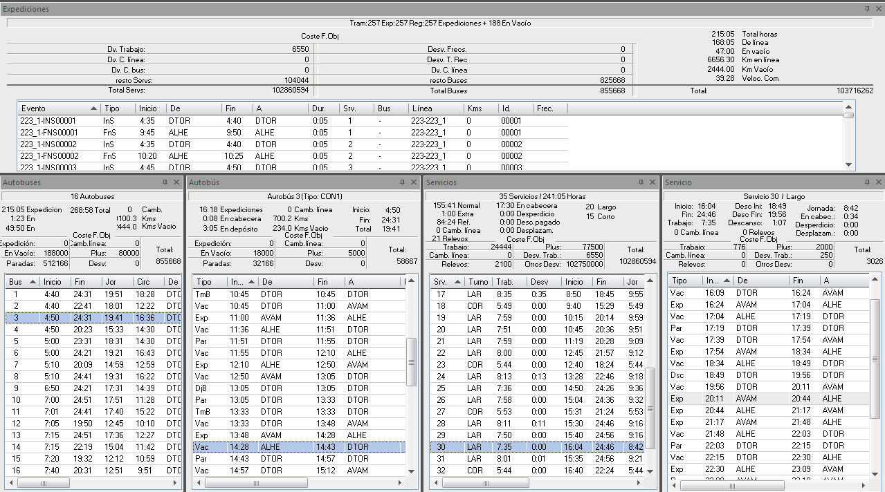
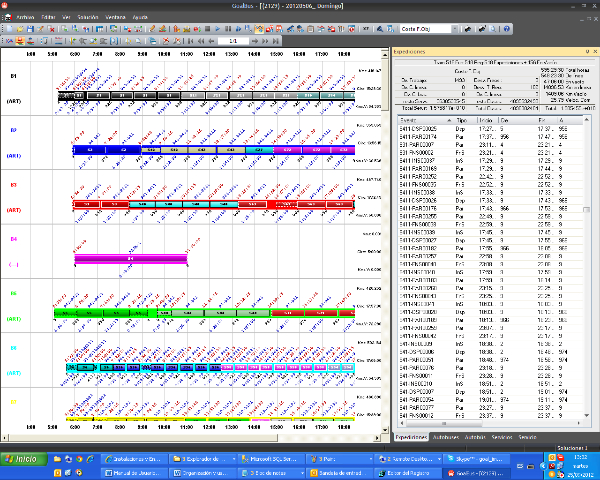
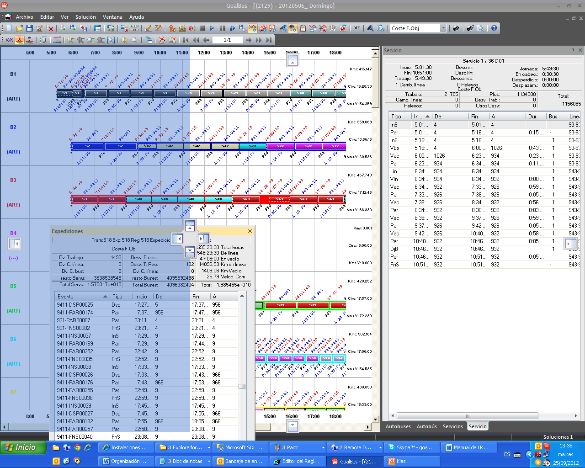

::: {#indicadores-centrales-y-pestañas .section .level4}
#### Indicadores centrales y pestañas

Además de los indicadores de margen superior, inferior, izquierdo y
derecho existe un grupo de 4 indicadores centrales. Cabe destacar que la
posibilidad de reorganizar las ventanas de información puede realizarse
una vez se ha abierto un cuadro con solución o antes de abrir cuadro
alguno.

A continuación se muestra la diferencia entre seleccionar el indicador
superior del grupo de indicadores centrales o seleccionar el indicador
de margen superior de la interfaz. La situación final de la ventana
estaría ubicada en la zona sombreada de azul:

[]{#_Toc465674571 .anchor}144 Colocación de un panel en la parte
superior de la ventana mediante el indicador central

[]{#_Toc465674572 .anchor}145 Colocación de un panel en la parte
superior de la ventana mediante el indicador superior

Otra de las funcionalidades de GoalBus® es la posibilidad de superponer
ventanas de información en la interfaz. Cada ventana queda accesible vía
un sistema de pestanas.

[]{#_Toc465674573 .anchor}146 Pestañas en paneles superpuestos

Para ello basta con seleccionar la cabecera de una ventana y arrastrarla
sobre la ventana destino a superponer. Aparecerá sobre la ventana
destino, el grupo de 4 indicadores con un nuevo indicador central
situado en el medio de dicho grupo. Desplazando la cabecera de la
ventana a superponer sobre este indicador hará que la ventana
desaparezca de la pantalla para que, tras soltar el botón del ratón, se
superponga finalmente la ventana sobre la ya existente.

A continuación, se muestra el flujo seguido para la superposición de una
ventana de información:

[]{#_Toc465674574 .anchor}147 Colocación de un panel superpuesto
mediante el indicador central

[]{#_Toc465674575 .anchor}148 Panel colocado en pestañas superpuestas

En los ejemplos siguientes se muestran activas 5 ventanas de
información, las cuales se pueden organizar de forma independiente en la
pantalla o juntas de forma superpuesta, seleccionando la cabecera de una
ventana y arrastrándola sobre la ventana destino a superponer.

En el Ejemplo 1 se muestran todas las ventanas de información separadas,
organizadas de manera independiente en la pantalla.

Por otra parte, en el Ejemplo 2, se muestran las 5 ventanas superpuestas
en un único panel y organizadas en pestañas. De esta manera se puede
disponer de información de diferentes ventanas (buses, servicios,..)
además de poder visualizar la solución del cuadro en la pantalla.

Cuando están organizadas por pestañas las ventanas de información de
Autobuses/Autobús y Servicios/Servicio se siguen sincronizando tal y
como está explicado en los apartados Sincronización ventana de autobuses
y detalle de autobús, y Sincronización ventana de servicios y detalle de
servicio de los capítulos 4.4.2 y 4.4.3.

-   Ejemplo 1:

[]{#_Toc465674576 .anchor}149 Paneles colocados lado a lado

-   Ejemplo 2:

[]{#_Toc465674577 .anchor}150 Paneles superpuestos

Las diferentes pestañas se pueden ordenar dentro de la propia ventana
arrastrando la pestaña deseada y reordenándola.

A su vez, para extraer una ventana de información de la ventana
superpuesta, basta con arrastrar la pestaña correspondiente fuera de la
ventana. De esta manera se podrán tener ventanas con información
superpuesta y ventanas independientes en la interfaz:

[]{#_Toc465674578 .anchor}151 Extracción de un panel superpuesto
:::
