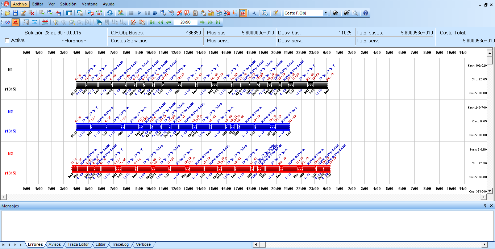

::: {#organización-y-personalización-de-las-ventanas-de-información-y-gráficas .section .level3}
### Organización y personalización de las ventanas de información y gráficas

GoalBus® permite a cada usuario organizar las distintas ventanas de
visualización a través de la propia interfaz de la aplicación.

Seleccionando y arrastrando el encabezado de cada ventana es posible
desplazarla y colocarla en diferentes posiciones de la interfaz de la
aplicación.

A continuación, se muestra la interfaz con la ventana de mensajes
situada en la parte inferior de la interfaz:

[]{#_Toc465674568 .anchor}141 Panel de mensajes
:::
