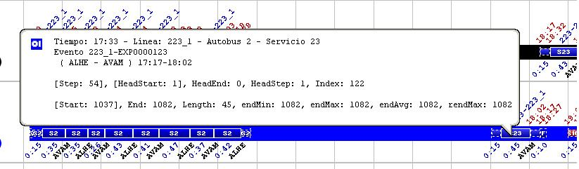

::: {#gráfico-de-líneas .section .level3}
### Gráfico de líneas

En las ilustraciones siguientes, se observan detalles de una solución
mostrada con este tipo de diagrama, en donde se aprecian los
característicos dientes de sierra con los que se representa la evolución
temporal de autobuses y servicios.

[[[]{#_Toc333431467 .anchor}]{#_Toc273703436 .anchor}]{#_Toc250455086
.anchor}

[]{#_Toc465674581 .anchor}154 Detalle Gráfico Líneas

Este detalle corresponde a la solución de un escenario con una sola
línea (la línea LP1) con cabecera en la parada PP1 y terminal en la
parada PP2. En la esquina inferior izquierda de cada línea aparece el
total de kilómetros recorridos por los vehículos en la línea, en este
caso \"0 Km.\" ya que no se han introducido los kilómetros de los arcos.
En la esquina inferior derecha se sitúa la velocidad comercial, que se
define como el cociente entre los kilómetros totales recorridos por los
vehículos en la línea y el tiempo total empleado por los vehículos en la
línea.

A cada Autobús que participa en la solución se le asigna un
identificador formado por la letra B (de Bus) y un número. En este
detalle pueden apreciarse tres autobuses (B1, B2 y B3). Cada Autobús se
representa con un color diferente del resto.

De la misma manera, a cada servicio de
conductor que participa en la solución se le asigna un identificador,
formado por la letra S (de Servicio) y un número. En este detalle se ven
también tres servicios (S1, S2 y S3). Cada servicio tiene un color
diferente del resto.

Una expedición se representa por dos líneas continuas paralelas que unen
una parada con otra. La línea de la izquierda representa el autobús que
realiza la expedición y la línea de la derecha el servicio de conductor
que realiza la expedición. Una expedición con líneas discontinuas
representa un viaje en vacío.

Se puede también visualizar los depósitos configurados en el escenario
junto a sus cabeceras. De esta manera, se tendrá una visión más realista
de la localización de los depósitos al mostrarse una distribución más
proporcional a la distancia real a la que se encuentran éstos de las
cabeceras.

En la siguiente imagen se observa el depósito **DEP M** asociado a la
parada **S01700** y los viajes en vacío.

[]{#_Toc465674582 .anchor}155 Detalle Gráfico Líneas

En el punto de inicio de una expedición podrá observarse un detalle
sobre el autobús, la hora y el servicio de conductor que realiza la
expedición. Al situarse el puntero del ratón sobre cualquier evento o
actividad del diagrama, aparecen en la barra de estado detalles sobre
dicho evento, así como una ventana de ayuda emergente con la misma
información (véanse las siguientes ilustraciones).[]{#_Toc222041711
.anchor}

[]{#_Toc465674583 .anchor}156 Barra de estado

[]{#_Toc465674584 .anchor}157 Ventana de ayuda emergente

Con el ratón situado sobre un punto del diagrama, en la barra de estado
se observa de izquierda a derecha:

-   La hora en la que se sitúa el ratón (17:33)

-   La línea afectada (línea 223\_1)

-   El autobús que participa en el evento, si lo hay (Autobús 2)

-   El servicio que participa en el evento (Servicio 23)

-   Tipo de evento producido (EXP0000123)

-   Intervalo de paradas en las que se produce el evento (ALHE-AVAM)

-   Periodo de tiempo en el que se produce el evento (17:17-18:02)
    > [[[[[]{#_Toc222216755 .anchor}]{#_Toc222135875
    > .anchor}]{#_Toc221622780 .anchor}]{#_Toc184120165
    > .anchor}]{#_Toc128972532 .anchor}
:::
