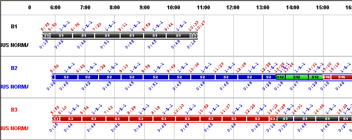

::: {#diagrama-de-gantt-de-autobuses .section .level3}
### Diagrama de Gantt de autobuses

Con este tipo de diagrama se visualiza la solución, desglosada por los
autobuses que participan en ella. Para cada autobús que participa en la
solución se muestra toda su actividad diaria.[[[]{#_Toc222131171
.anchor}]{#_Toc222041713 .anchor}]{#_Toc333431470 .anchor}

[]{#_Toc465674585 .anchor}158 Detalle Gantt Autobuses

En la ilustración, se muestra un detalle de un diagrama de Gantt de
autobuses de tres autobuses, B1, B2 y B3. El primero de ellos, B1
representado en color negro (fondo), puede verse que sólo lo lleva un
único conductor mientras que en el segundo y el tercer autobuses, B2 y
B3, participan más de uno. Para el B2 (azul) las diez primeras
expediciones las realiza el servicio S2 (azul), las 3 siguientes el
servicio S12 (verde) y a partir de ahí el servicio S16 (rojo). En el
tercer autobús, B3 de color rojo, las primeras expediciones las realiza
el servicio S3 (rojo) y las siguientes el servicio S1 (negro) que
previamente había conducido el B1.

Al igual que ocurre con el gráfico de líneas, situando el cursor sobre
cualquier elemento de un diagrama, se muestra en la barra de estado
detalles sobre el evento señalado, apareciendo además una ventana de
ayuda emergente con la misma información.
:::
