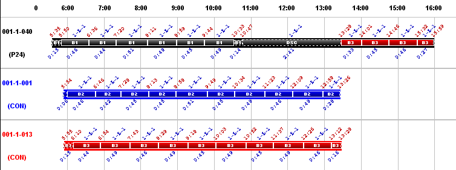

::: {#diagrama-de-gantt-de-servicios-de-conductor .section .level3}
### Diagrama de Gantt de servicios de conductor

Con este tipo de diagrama se visualiza la solución, desglosada por los
servicios que participan en ella. Para cada servicio que participa en la
solución se muestra toda su actividad diaria.

[]{#_Toc333431471 .anchor}

[]{#_Toc465674586 .anchor}159 Detalle Gantt Servicios

En la ilustración, se muestra un detalle de un diagrama de Gantt de
servicios de tres servicios: negro, azul y rojo. Para cada servicio se
muestran los eventos que protagoniza y con qué autobús los realiza. Por
ejemplo, en el primer servicio (negro) las seis primeras expediciones
las realiza con el autobús B1 (negro) en el trayecto 1 de la línea 1,
luego tiene un periodo de descanso y después realiza cuatro expediciones
más con el autobús B3 (rojo) en el trayecto 1 de la línea 1. El segundo
servicio (azul) realiza diez expediciones con el autobús B2 (azul) en el
trayecto 1 de la línea 1 y el tercero (rojo) lo mismo que el segundo
pero con el autobús B3 (rojo) que luego cederá al primer servicio.

Al igual que ocurre con los anteriores diagramas, situando el cursor
sobre cualquier elemento de un diagrama, se muestra en la barra de
estado detalles sobre el evento señalado, apareciendo además una ventana
de ayuda emergente con la misma información.

[[[[[[[[[[]{#_Toc222216757 .anchor}]{#_Toc222135876
.anchor}]{#_Toc221622782 .anchor}]{#_Toc184120167
.anchor}]{#_Toc128972534 .anchor}]{#_Toc72844195
.anchor}]{#_Toc527351005 .anchor}]{#_Toc527263848
.anchor}]{#_Toc525974368 .anchor}]{#_Toc525560407 .anchor}
:::
