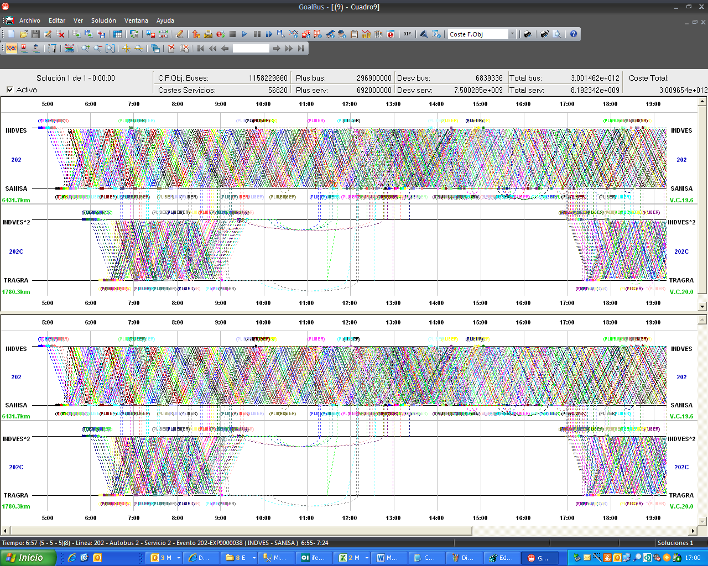
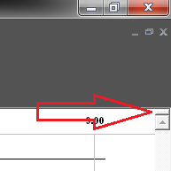

::: {#múltiples-diagramas-de-una-solución .section .level3}
### Múltiples diagramas de una solución

La ventana principal de diagramación de soluciones tiene la propiedad de
"partirse" para poder ver dos diagramas a la vez en la misma pantalla.

[]{#_Toc465674587 .anchor}160 Múltiples Diagramas

Para partir la ventana en dos, hay que hacer doble clic o hacer clic y
arrastrar hacia abajo el separador que aparece en la esquina superior
derecha de la ventana principal.

:::
