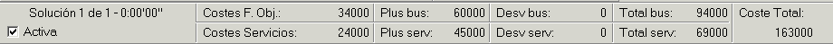

::: {#ventana-de-información-de-costes .section .level3}
### Ventana de información de costes

La ventana de información de costes muestra los detalles de los costes
que implica la solución que se está visualizando en la ventana principal
de diagramación de soluciones. Esta ventana puede ocultarse o mostrarse
y puede contener los costes reales o los costes de la función objetivo
en función de lo que el usuario elija en el despegable pertinente (véase
apartado 4.1.2 Menús con un escenario abierto).

[]{#_Toc333431472 .anchor}

[]{#_Toc465674588 .anchor}161 Ventana de información de costes

Esta ventana muestra la siguiente información de izquierda a derecha:

-   Número de solución mostrada y tiempo tardado en obtenerla. (Solución
    > 1 de 1 - 0:00'00'')

-   Solución activa o no: Elegible por el usuario. Si un escenario está
    > activo, GoalBus® expone el escenario junto con su solución hacia
    > sistemas de información externos (como por ejemplo GoalDriver®).
    > Cabe la posibilidad de guardar una solución como activa con turnos
    > inválidos. El turno inválido se guardará como un turno válido en
    > base de datos si el cliente así lo desea (siendo este turno válido
    > la versión más cercana al turno inválido). Esto permite poder
    > exportar una solución como activa y válida, omitiendo pequeños
    > incumplimientos que indican que un turno es inválido (siempre a
    > decisión del planificador).

-   Solución parcial o no: Si la solución visualizada no tiene todos sus
    > servicios de conductor válidos, aparece la palabra Parcial.

-   La primera fila se refiere a los costes de los autobuses, desglosado
    > por costes de horas de uso (Costes F. Obj.), por pluses (Plus bus)
    > y por desviaciones de los tiempos óptimos (Desv. bus). A
    > continuación aparece el total de costes debido a los autobuses
    > (Total bus).

-   La segunda fila se refiere a los costes de los servicios, desglosado
    > por costes de horas de jornada (Costes Servicios), por pluses
    > (Plus serv.) y por desviaciones de los tiempos óptimos (Desv.
    > serv.) A continuación aparece el total de costes debido a los
    > servicios (Total serv.).

-   Coste total de la solución (Coste Total: Total bus + Total serv.)
:::
