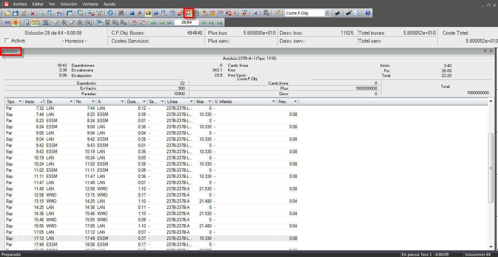

::: {#ventana-de-información-de-autobús .section .level4}
#### Ventana de información de autobús

Además de la ventana general de autobuses también existe la ventana de
información de autobús en la que se detallan los distintos eventos que
realiza el autobús seleccionado así como los mismos costes anteriormente
especificados para dicho bus.

[]{#_Toc465674590 .anchor}163 Detalle de información de autobús

En cuanto a los eventos, para cada uno de ellos se muestra:

-   Su tipo (Tipo)

-   La hora de inicio (Inicio) y final (Fin)

-   Las paradas de inicio (De) y de fin (A)

-   Su duración (Dur.)

-   El servicio de conductor asignado al autobús durante el evento si
    > procede (Serv.)

-   La línea-trayecto en la que sucede el evento (Lin.)

-   Los kilómetros recorridos durante el evento
    > (Kms)[[[[[]{#_Toc289165955 .anchor}]{#_Toc222135880
    > .anchor}]{#_Toc221622786 .anchor}]{#_Toc128972538
    > .anchor}]{#_Toc525974371 .anchor}
:::
