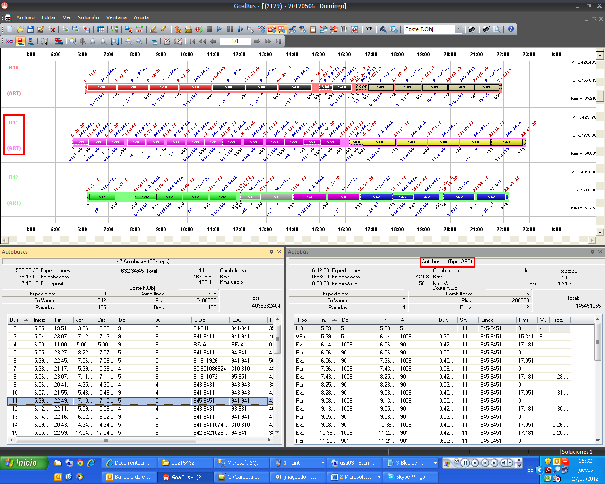

::: {#sincronización-ventana-de-autobuses-y-detalle-de-autobús .section .level4}
#### Sincronización ventana de autobuses y detalle de autobús

En el caso de tener disponible la ventana de información de autobuses y
la ventana de información de autobús se puede observar el sincronismo
existente entre los datos de ambas ventanas. Al seleccionar un bus en la
ventana de información de autobuses, se seleccionará dicho bus en la
ventana de información de autobús. Si se selecciona otro bus en la
ventana de información, automáticamente se selecciona este nuevo bus en
la ventana de información de autobús.

A su vez, en el Gantt de autobuses se mostrará el bus que se tiene
seleccionado en estas ventanas de autobuses.

:::
