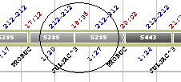

::: {#el-localizador-automático .section .level4}
#### El localizador automático

Al seleccionar cualquier fila de la tabla, la ventana principal de
diagramación de soluciones hace un desplazamiento automático hasta
señalar el inicio del autobús o del evento seleccionado en el diagrama.
Este localizador automático funciona con los tres diagramas de solución,
gráfico de líneas y de Gantt en sus dos vertientes.

[]{#_Toc333431480 .anchor}

[]{#_Toc465674591 .anchor}164 El localizador automático

El localizador automático trabaja en dos sentidos como se explica a
continuación.

Si dentro de la ventana de información general de autobuses se hace clic
en algún autobús, la ventana principal de diagramación de soluciones
hace un desplazamiento automático hasta señalar el comienzo del autobús.
Si en la ventana de información de los eventos de un autobús
seleccionado se selecciona un evento también se señala dicho evento
concreto en la solución (véase ilustración más arriba).

Si dentro de la ventana principal de diagramación de soluciones se hace
clic en algún evento de cualquier autobús, en la ventana de información
general de autobuses se seleccionaría el autobús correspondiente y en la
ventana de autobús seleccionado se destacaría dicho evento.

[[[[]{#_Toc222216761 .anchor}]{#_Toc221622787 .anchor}]{#_Toc184120171
.anchor}]{#_Toc128972539 .anchor}
:::
