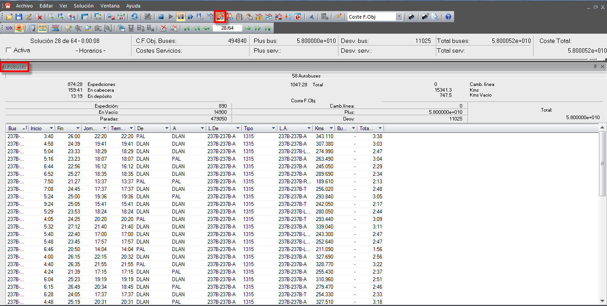
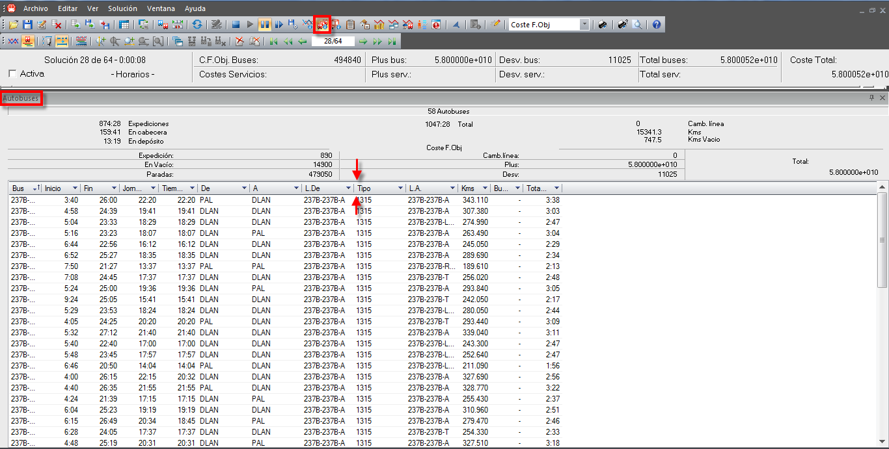
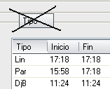
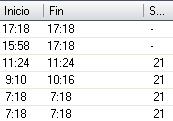
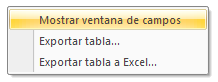
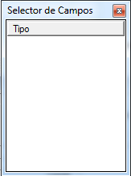

::: {#ventana-de-información-de-autobuses .section .level3}
### Ventana de información de autobuses

La ventana de información de autobuses muestra información detallada
sobre los autobuses que participan en la solución visualizada en la
ventana principal de diagramación de soluciones.

[]{#_Toc465674589 .anchor}162 Ventana de información de autobuses

Esta ventana de información contiene el número de autobuses, que
participan en la solución e incluye un resumen con los principales
indicadores sobre el uso de los Autobuses:

-   Tiempo total de uso de los autobuses (Total)

-   Tiempo total de parada de los autobuses en cabecera (En cabecera)

-   Tiempo total de uso de los autobuses en expediciones (Expediciones)

-   Número de cambios de línea de los autobuses (Camb. Línea)

Además también dispone de un resumen de los costes de la solución que se
imputan a los autobuses:

-   Por expedición (Expedición)

-   Por viajes en vacío (En Vacío)

-   Por tiempos de parada (Paradas)

-   Por cambios de línea (Camb. Línea)

-   Por pluses de autobús (Plus)

-   Por desviaciones del tiempo óptimo (Desv.)

-   El total de costes debido a los Autobuses (Total)

Parte de esta información aparece también en la ventana de información
de costes y, al igual que ocurre con ella, es posible ver los costes
reales o los de la función objetivo.

La parte inferior de esta ventana contiene una tabla con toda la
información sobre los autobuses que participan en la solución. Para cada
Autobús se detalla:

-   Su número (Bus)

-   La hora de inicio (Inicio) y de finalización (Fin)

-   La duración de su jornada (Jor)

-   Las paradas de inicio (De) y de finalización (A)

-   Las líneas de origen (L.De) y de finalización (L.A)

-   El total de kilómetros recorridos (Kms).

-   Se ha añadido una columna llamada Circ, que recoge el tiempo de
    > circulación de buses, incluyendo las paradas de cabecera, es
    > decir, el tiempo de jornada menos el tiempo en depósito.

Las columnas que aparecen en esta ventana pueden ocultarse o mostrarse,
a decisión del usuario. Situando el cursor sobre la barra donde se
sitúan los nombres de las columnas, y manteniendo pulsado el botón
izquierdo del ratón sin soltarlo, se arrastra el nombre de la columna
que no se va a mostrar. También pueden exportarse los datos que aparecen
en la tabla a un fichero plano (.txt) con la opción Exportar tabla...

Luego, como puede observarse en la siguiente imagen, se arrastra el
título de la columna fuera de la fila que contiene los nombres de
columnas.

[]{#_Toc333431474 .anchor}

Finalmente, se suelta el ratón en ese punto, y la columna seleccionada
desaparece de la ventana.

[]{#_Toc333431475 .anchor}

Para recuperar la visualización de la columna que se ha ocultado, se
debe hacer clic con el botón derecho del ratón. Aparecerá el siguiente
menú:

[]{#_Toc333431476 .anchor}

Al darle clic en "Mostrar ventana de campos", aparecerá otro cuadro el
cual se encuentran las columnas no visualizadas actualmente en la
ventana.

Arrastrando el nombre de la columna a visualizar nuevamente al cuadro,
agregará la columna a la ventana.
:::
