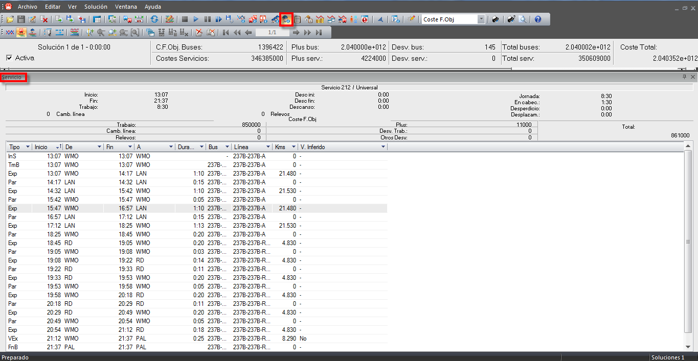

::: {#ventana-de-información-de-servicio-de-conductor .section .level4}
#### Ventana de información de servicio de conductor

Como en el caso de los buses también existe la ventana de detalle del
servicio

[]{#_Toc465674593 .anchor}166 Detalle de servicio de conductor

En esta ventana se muestra la secuencia de eventos únicamente del
servicio seleccionado y sus costes. Los costes que aparecen son los
mismos que los que pueden observarse en la ventana sin expandir, pero
solo referidos al servicio de conductor seleccionado.

Existe una opción de configuración interna (el cliente debe requerirlo a
GOAL SYSTEMS para que vaya incluido en el programa de instalación) por
la cual al exportar las columnas de "kms" de las ventanas de información
a un archivo Excel se elimine el separador de decimales.

 

En cuanto a los eventos, para cada uno de ellos se muestra:

-   El tipo de evento (Tipo)

-   Las horas de inicio (Inicio) y Final (Fin) del evento

-   Las paradas de inicio (De) y de fin (A) de cada evento

-   La duración del evento (Dur.)

-   El autobús asignado al conductor durante el evento, si procede (Bus)

-   La línea de Autobús en la que sucede el evento
    > (Lin.)[]{#_Toc525974373 .anchor}
:::
