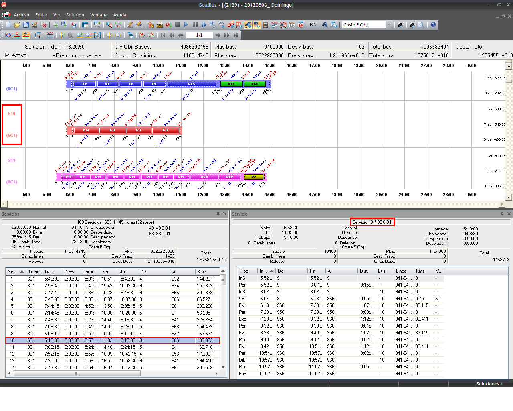

::: {#sincronización-ventana-de-servicios-y-detalle-de-servicio .section .level4}
#### Sincronización ventana de servicios y detalle de servicio

En el caso de tener disponible la ventana de información de servicios y
la ventana de información de servicio se puede observar el sincronismo
existente entre los datos de ambas ventanas. Al seleccionar un servicio
en la ventana de información de servicios, se seleccionará dicho
servicio en la ventana de información de servicio. Si se selecciona un
servicio distinto, automáticamente se selecciona este nuevo servicio en
la ventana de información de servicio.

A su vez, en el Gantt de servicios se mostrará el servicio que se tiene
seleccionado en estas ventanas de servicios.

[]{#_Toc465674594 .anchor}167 Sincronización de eventos en las tablas y
los diagramas
:::
