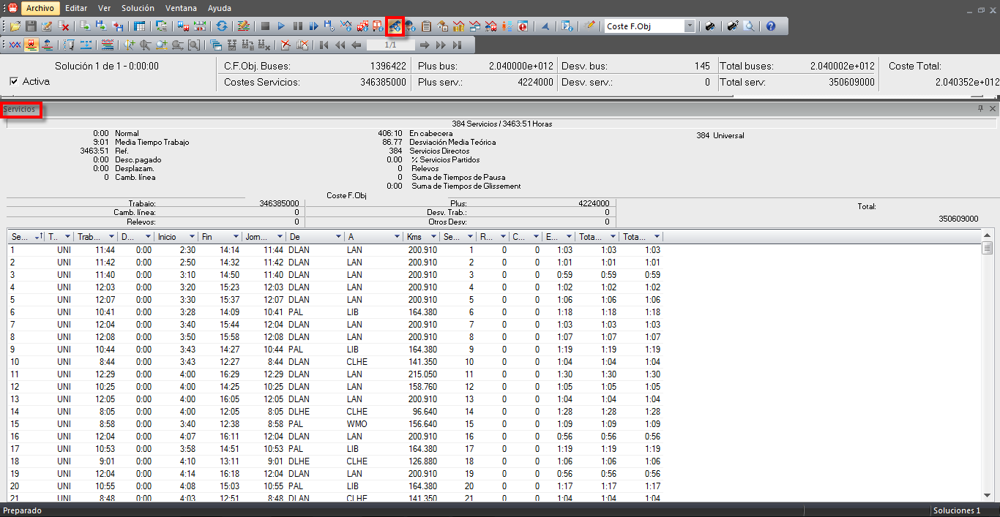

::: {#ventana-de-información-de-servicios-de-conductor .section .level3}
### Ventana de información de servicios de conductor

La ventana de información de servicios de conductor muestra información
detallada sobre los servicios de conductor que participan en la solución
visualizada en la ventana principal de diagramación de soluciones.

[]{#_Toc465674592 .anchor}165 Ventana de información de servicios de
conductor

Esta ventana de información contiene el número de servicios de
conductor, que participan en la solución e incluye un resumen con los
principales indicadores sobre los servicios:

-   Tiempo total de jornada normal (Normal)

-   Tiempo total de horas extra (Extra)

-   Tiempo total de refuerzos (Ref.)

-   Número total de cambios de línea (Camb. Línea)

-   Número total de cambios de Autobús (Camb. Bus)

-   Tiempo total en cabecera (En cabecera)

-   Tiempo total desperdiciado (Desperdicio)

-   Tiempo total de descanso pagado (Desc. pagado)

-   Tiempo total invertido en desplazamientos (Desplazam.)

También se muestra el número total de cada tipo de servicios de
conductor consumidos por la solución, en el ejemplo de arriba: "403
normal", "219 extendido", "11 Nocturno",...

Además también dispone de un resumen de los costes de la solución que se
imputan a los servicios de conductor:

-   Por horas de trabajo (Trabajo)

-   Por cambios de línea (Camb. Línea)

-   Por cambios de autobús (Camb. Bus)

-   Por pluses (Plus)

-   Por desviaciones del tiempo óptimo de trabajo (Desv. Trab.)

-   Por desviaciones de otro tipo (Otros Desv.)

-   El total de costes debido a los servicios de conductor (Total).

Parte de esta información aparece también en la ventana de información
de costes y, al igual que ocurre con ella, es posible ver los costes
reales o los de la función objetivo.

La parte inferior de esta ventana contiene una tabla con toda la
información sobre los servicios que participan en la solución. Para cada
servicio se detalla:

-   El número de servicio (Serv.)

-   El tipo de servicio de conductor que realiza el servicio (Turno)

-   Las horas trabajadas (Trab.)

-   La desviación del tiempo óptimo trabajado (Desv.)

-   La hora de inicio de jornada (Inicio)

-   La hora de fin de jornada (Fin)

-   La duración de la jornada de trabajo (Jor.)

-   Las paradas de incorporación (De) y de fin de jornada (A)

-   El total de kilómetros recorridos (Kms)

-   Número de relevos de cada servicio (Relevos), es decir, el número de
    > veces que entrega el autobús a otro conductor.

-   Cambios de bus (Cambios Bus), cuántos buses diferentes conduce
    > durante su jornada, exceptuando el primero.
:::
