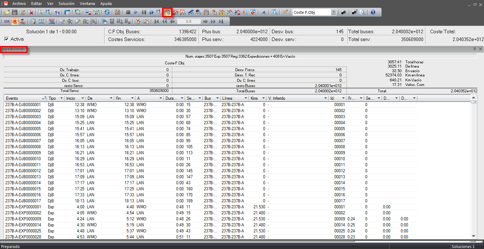

::: {#ventana-de-información-de-expediciones .section .level3}
### Ventana de información de expediciones

La ventana de información de eventos muestra información sobre los
eventos que suceden en la solución.

[]{#_Toc465674595 .anchor}168 Ventana de información de expediciones

Esta ventana de información contiene el número de expediciones y viajes
en vacío que se realizan en la solución e incluye un resumen con los
principales indicadores sobre los costes por desvío de los valores
óptimos. Se muestran indicadores sobre:

-   El número total de horas (Total horas)

-   El número total de horas empleadas en las expediciones (De línea)

-   El número total de horas empleadas en viajes en vacío (En vacío)

-   El número total de kilómetros en las expediciones (Km en Línea)

-   El número total de kilómetros en viajes en vacío (Km en Vacío)

-   La velocidad comercial (Veloc com)

La tabla con información de todos los eventos que forman parte de la
solución muestra para cada evento la siguiente información:

-   Identificador del evento (Evento)

-   Tipo del evento (Tipo)

-   Horas de inicio (Inicio) y fin (Fin) del evento

-   Paradas de inicio (De) y de fin (A) de cada evento

-   Duración del evento (Dur.)

-   Servicio que participa en el evento (Serv.)

-   Número del autobús que participa en el evento (Bus)

-   Línea de Autobús en la que sucede el evento (Línea)

-   Kilómetros recorridos durante el evento (Kms.)

-   Vacíos inferidos en el cuadro

-   Número del evento (Id)

-   Frecuencia (Intervalo desde la salida anterior en el mismo punto del
    > trayecto)

-   Desvío respecto de la frecuencia óptima

-   Servbus (Código del servicio de autobus fijado)

-   Tipo de autobús asignado al evento

[[[[[]{#_Toc289165959 .anchor}]{#_Ref250455306 .anchor}]{#_Toc222216763
.anchor}]{#_Toc222135882 .anchor}]{#_Toc218306229 .anchor}
:::
