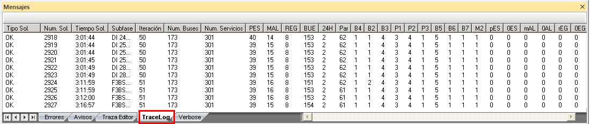
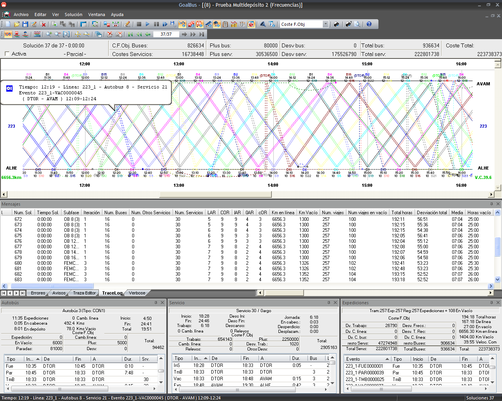

::: {#información-de-traza-en-el-panel-tracelog .section .level4}
#### Información de traza en el panel Tracelog

La ventana de Tracelog muestra una serie de campos que recogen
información sobre buses y tipos de turnos necesarios para el problema, y
sus costes asociados. En concreto, dichos campos son:

+-----------------------------------+-----------------------------------+
| Nombre del campo                  | Descripción                       |
+===================================+===================================+
| Tipo Sol.                         | Indica si la solución es parcial  |
|                                   | ('**X**') o es una solución       |
|                                   | válida ('**Ok**').                |
+-----------------------------------+-----------------------------------+
| Num. Sol.                         | Número de solución encontrada.    |
+-----------------------------------+-----------------------------------+
| Tiempo Sol.                       | Instante de tiempo en el que se   |
|                                   | genera la solución.               |
+-----------------------------------+-----------------------------------+
| Subfase                           | Fase algorítmica que encuentra la |
|                                   | solución.                         |
+-----------------------------------+-----------------------------------+
| Iteración                         | Número de iteración sobre la fase |
|                                   | algorítmica en donde se genera la |
|                                   | solución.                         |
+-----------------------------------+-----------------------------------+
| Num. Buses                        | Número de buses necesarios para   |
|                                   | cubrir el problema.               |
+-----------------------------------+-----------------------------------+
| Num. Servicios                    | Número de servicios necesarios    |
|                                   | para cubrir el problema.          |
+-----------------------------------+-----------------------------------+
| Número de servicios según su tipo | Muestra una columna por cada tipo |
|                                   | de turno definido en el cuadro y  |
|                                   | el número de servicios empleados  |
|                                   | para cada tipo de turno.          |
+-----------------------------------+-----------------------------------+
| Número de servicios inválidos     | Muestra una columna por cada tipo |
| según su tipo                     | de turno inválido y el número de  |
|                                   | servicios empleados en cada uno   |
|                                   | de ellos.                         |
+-----------------------------------+-----------------------------------+
| Km en línea                       | Número de kilómetros comerciales  |
|                                   | empleados.                        |
+-----------------------------------+-----------------------------------+
| Km Vacío                          | Número de kilómetros en vacíos    |
|                                   | empleados.                        |
+-----------------------------------+-----------------------------------+
| Num. Viajes                       | Número de trayectos comerciales   |
|                                   | empleados.                        |
+-----------------------------------+-----------------------------------+
| Num viajes en vacío               | Número de viajes en vacío         |
|                                   | empleados.                        |
+-----------------------------------+-----------------------------------+
| Total horas                       | Número total de horas de trabajo  |
|                                   | empleados.                        |
+-----------------------------------+-----------------------------------+
| Horas vacío                       | Número total de horas de trabajo  |
|                                   | empleados en trayectos vacío.     |
+-----------------------------------+-----------------------------------+
| Horas extra                       | Número total de horas extra       |
|                                   | empleados.                        |
+-----------------------------------+-----------------------------------+
| Horas noche                       | Número total de horas de noche    |
|                                   | empleados.                        |
+-----------------------------------+-----------------------------------+
| Coste total servicios             | Valor del campo **Total serv** de |
|                                   | la ventana de solución.           |
+-----------------------------------+-----------------------------------+
| Coste total buses                 | Valor del campo **Total busserv** |
|                                   | de la ventana de solución.        |
+-----------------------------------+-----------------------------------+
| Desv (Bus)                        | Valor del campo **Desv bus** de   |
|                                   | la ventana de solución.           |
+-----------------------------------+-----------------------------------+
| Coste por explotación de jornada  | Coste de la solución por          |
| (Bus)                             | explotación de jornada de bus.    |
+-----------------------------------+-----------------------------------+
| Coste \'superar la capacidad por  | Coste de la solución por superar  |
| tipo de bus y depósito\' (Bus)    | la capacidad por tipo de bus y    |
|                                   | depósito.                         |
+-----------------------------------+-----------------------------------+
| Coste por desvío en los tiempos   | Coste de la solución por desvío   |
| de recorrido (Bus)                | de los tiempos de recorrido       |
|                                   | óptimos.                          |
+-----------------------------------+-----------------------------------+
| Coste por desvío de las           | Coste de la solución por desvío   |
| capacidades (Bus)                 | de las capacidades de los         |
|                                   | depósitos.                        |
+-----------------------------------+-----------------------------------+
| Coste Optimización (Bus)          | Coste de opción de la relajación  |
|                                   | **Buses deben acabar en inicio**. |
+-----------------------------------+-----------------------------------+
| Coste por hora del desvío de las  | Coste de la solución por desvío   |
| frecuencias (Bus)                 | de las frecuencias óptimas.       |
+-----------------------------------+-----------------------------------+
| Coste hora de autobús inactivo    | Coste de la solución por hora de  |
| (Bus)                             | autobús inactivo                  |
+-----------------------------------+-----------------------------------+
| Coste por desvío de cambios de    | Coste de la solución por desvío   |
| línea de autobús (Bus)            | del número óptimo de cambios de   |
|                                   | línea por autobús.                |
+-----------------------------------+-----------------------------------+
| Plus por cambio de línea de       | Coste de la solución por cambio   |
| autobús (Bus)                     | de línea por autobús.             |
+-----------------------------------+-----------------------------------+
| Plus por autobús (Bus)            | Coste de la solución por empleo   |
|                                   | de un autobús.                    |
+-----------------------------------+-----------------------------------+
| Plus por kilómetro en vacío (Bus) | Coste de la solución por          |
|                                   | kilómetro en vacío empleado.      |
+-----------------------------------+-----------------------------------+
| Plus por kilómetro (Bus)          | Coste de la solución por          |
|                                   | kilómetro empleado.               |
+-----------------------------------+-----------------------------------+
| Plus por expediciones en vacío    | Coste de la solución por número   |
| (Bus)                             | de expediciones en vacío          |
|                                   | empleados en la solución.         |
+-----------------------------------+-----------------------------------+
| Plus por expediciones (Bus)       | Coste de la solución por número   |
|                                   | de expediciones empleados.        |
+-----------------------------------+-----------------------------------+
| Coste de servicios (Srv.)         | Valor campo **Costes Servicios**  |
|                                   | de la ventana de solución.        |
+-----------------------------------+-----------------------------------+
| Coste por desvío de servicios     | Valor campo **Desv** **serv** de  |
| (Srv.)                            | la ventana de solución.           |
+-----------------------------------+-----------------------------------+
| Plus por servicio (Srv.)          | Coste de la solución por el       |
|                                   | número de servicios empleados.    |
+-----------------------------------+-----------------------------------+
| Plus por cambio de línea de       | Coste de la solución por el       |
| servicios (Srv.)                  | número de cambios de línea por    |
|                                   | servicios empleados.              |
+-----------------------------------+-----------------------------------+
| Coste por desvío de cambios de    | Coste de la solución por desvío   |
| línea de servicio (Srv)           | del número óptimos de cambios de  |
|                                   | línea empleados.                  |
+-----------------------------------+-----------------------------------+
| Plus por cambio de autobús (Srv.) | Coste de la solución por número   |
|                                   | de cambios de autobús por         |
|                                   | servicio empleado.                |
+-----------------------------------+-----------------------------------+
| Coste por desvío de los cambios   | Coste de la solución por desvío   |
| de autobús por servicio (Srv.)    | del número óptimo de cambios de   |
|                                   | autobús por servicio empleados.   |
+-----------------------------------+-----------------------------------+
| Coste de optimización (Srv.)      | Costes de las opciones de         |
|                                   | relajación **Los servicios deben  |
|                                   | finalizar en inicio** y **Segundo |
|                                   | descanso debe ser en inicio**.    |
+-----------------------------------+-----------------------------------+
| Coste por desvío de grupos (Srv.) | Coste de la solución por desvío   |
|                                   | del número óptimo de servicios    |
|                                   | empleados según su grupo.         |
+-----------------------------------+-----------------------------------+
| Coste por relevo en estación      | Suma de costes por relejo en      |
| (Srv.)                            | paradas.                          |
+-----------------------------------+-----------------------------------+
| Coste por desvío num. min/max     | Coste de la solución por desvío   |
| servicios por Turno (Srv.)        | del número mínimo y máximo de     |
|                                   | servicios por tipo de turno       |
|                                   | definido.                         |
+-----------------------------------+-----------------------------------+

Para acceder a la ventana de Tracelog, pinchamos desde la ventana de
solución en el botón de Mostrar información de errores
 y en la ventana que aparece, se debe pinchar
en la pestaña Tracelog:

[]{#_Toc333431487 .anchor}

[]{#_Toc465674598 .anchor}171 Acceso a Tracelog
:::
