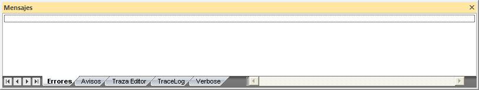
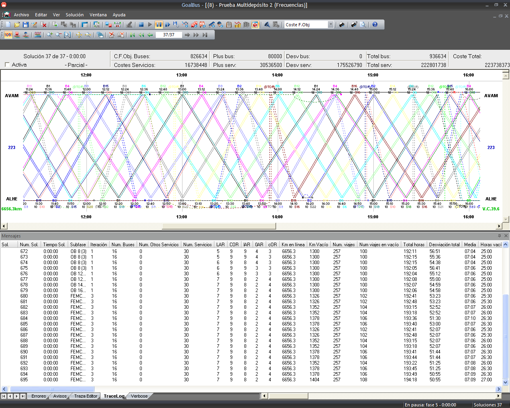

::: {#ventana-de-información-de-errores .section .level3}
### Ventana de información de errores

En la ventana de información de errores podemos
encontrar los siguientes apartados:

[]{#_Toc465674596 .anchor}169 Ventana de información de errores

**Errores:** Muestra los errores e incoherencias de los datos
introducidos en GoalBus®

**Avisos:** Es información relevante que muestra GoalBus®, sobre la
solución.

**Traza del editor:** Muestra avisos y parámetros que no se cumplen y
que están modelados en GoalBus®

**Tracelog**: Ventana informativa con diversa información de las
distintas soluciones que GoalBus® va generando y los costes asociados a
cada una de ellas. Con esta funcionalidad podemos observar la evolución
de los costes y datos como número de buses, servicios, etc., de cada una
de las soluciones, y así tener una mejor visión sobre hacia donde irá
encaminada la solución final que se pretende mejorar.

[]{#_Toc333431486 .anchor}

[]{#_Toc465674597 .anchor}170 Traza del cálculo (Tracelog)

**Verbose**: Sirve para detectar errores de parametrización que puede
impedir calcular soluciones válidas.
:::
