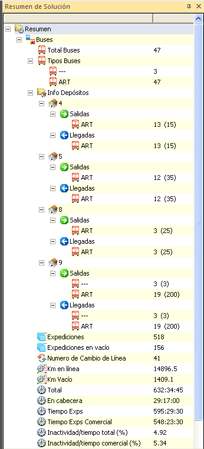

::: {#ventana-de-resumen-de-solución---buses .section .level4}
#### Ventana de resumen de solución - Buses

En el apartado Buses de la ventana resumen de la solución se muestra
primeramente, el número total de buses que se han calculado para el
cuadro.

En el siguiente sub-apartado se muestran los tipos de buses existentes
en la solución del cuadro.

En el ejemplo que se encuentra a continuación, existen 47 buses de tipo
ART (Articulado) y 3 buses sin tipo de autobús definido (\-\--) y por
tanto, que no se tienen en cuenta como tipo de bus en la solución.

En el sub-apartado siguiente, Info Depósitos, se muestra la información
relativa a los depósitos y al número de entradas y salidas que se
producen en los mismos.

Los depósitos vienen identificados con su número de código y en ellos se
indican los buses que entran y salen por tipo de bus. Entre paréntesis
se representa la capacidad total del depósito.

Por último se recogen otros datos como el número de expediciones,
expediciones en vacío, número de cambios de línea, kilometraje en línea
y en vacío y diversos tiempos totales de la solución del cuadro.

[]{#_Toc465674600 .anchor}173 Resumen de solución - autobuses
:::
