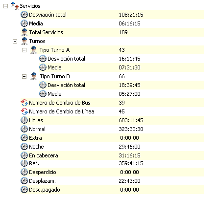

::: {#ventana-de-resumen-de-solución---servicios .section .level4}
#### Ventana de resumen de solución - Servicios

En el apartado Servicios, del resumen de la solución, se muestra el
número total de horas de trabajo, de desplazamiento, de noche o en
cabecera, pero también se recoge un resumen más detallado por cada tipo
de turno de servicio que existe en la solución del cuadro calculado.

Por último se detallan otros datos como el número de cambios de bus y de
línea, total de horas trabajadas en la solución,...

En el ejemplo que se muestra a continuación, para cada tipo de turno de
servicio (Tipo Turno A y Tipo Turno B) se detalla la media de horas de
trabajo, así como la suma de la desviación de todos los servicios
respecto a su óptimo.

[]{#_Toc465674601 .anchor}174 Resumen de solución - servicios
:::
