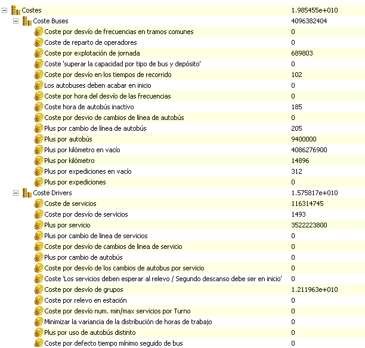

::: {#ventana-de-resumen-de-solución---costes .section .level4}
#### Ventana de resumen de solución - Costes

En el apartado de Costes del resumen de la solución se indica el coste
objetivo total de la solución calculada por GoalBus®, y en dos
sub-apartados (Coste Buses y Coste Drivers) se detallan los costes
objetivo que se aplican a los buses y a los conductores:

[]{#_Toc465674602 .anchor}175 Resumen de solución - costes
:::
